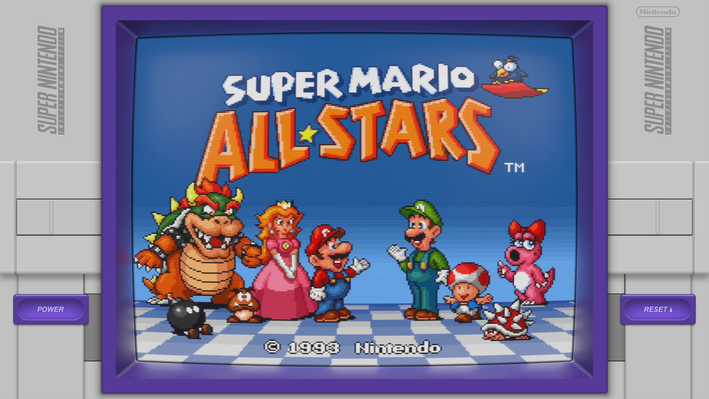
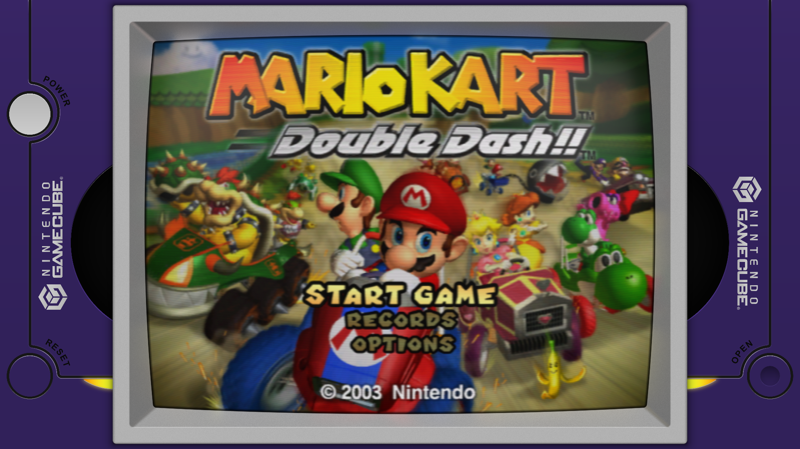
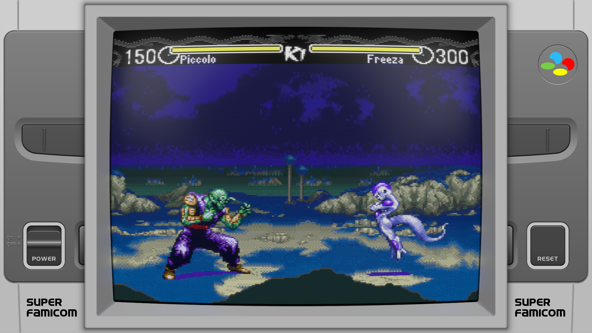

# HSM Reflection Shader Graphics

## 4K System graphics created specifically for use with the HSM Mega Bezel Reflection Shader.

This project is an attempt to provide end users with high quality art to use in conjunction with the amazing **Mega Bezel Reflection Shader** created by **HyperspaceMadness**.

My feedback and announcement page is on Libretro:

https://forums.libretro.com/t/duimon-hsm-reflection-shader-graphics-feedback-and-updates/28146

The shader feedback and announcement page is at:

https://forums.libretro.com/t/hsm-mega-bezel-reflection-shader-feedback-and-updates/25512

While developing this art I have a few select goals.

* All art will be vector based.
* If raster effects are used at any point they will be 300dpi. This may include text layer imports from Photoshop.
* Backgrounds, for graphics that don’t fill the screen, may be raster images, with the intent that (In future shader versions) users can swap in a background of their choosing.
* High quality is a must! When using existing art as a reference, it will be paired with photographic references in an effort to improve it's realism and give it a cohesive style.
* Final raster output of 4K at 300dpi
* All project files will be provided. Layer structure within the project files will assume that an end user may want to change the bezel size or placement, and *attempt* to make balancing the artwork easy.
* Inclusion of logo, night, plain, and 4K vertical versions, where they make sense.

Some screenshots...








## Installation

The Mega Bezel Community is a collaboration between a growing number of artists and the shader developer.

We have agreed, in an effort to create cohesion among our various projects, to intend 
our works reside in a "Mega_Bezel_Packs" folder. (Within the RA shader folder.) This
keeps the shader folder tidy while still allowing for a relatively short browse to the 
artists presets.

**For cross-platform compatibility, the "Mega_Bezel_Packs" folder is now required. All the paths are now relative.**

___

## Mega Bezel

Just a note that the Mega Bezel is not bundled with my pack. It will need to be installed first using the instructions on the [Mega Bezel thread](https://forums.libretro.com/t/hsm-mega-bezel-reflection-shader-feedback-and-updates/25512).
___


## Installation using the release zip

The folder structure is...

    Retroarch/shaders/Mega_Bezel_Packs/Duimon-Mega-Bezel
        	/Graphics
        	/Presets


An example presets folder and contents is...

    Retroarch/shaders/Mega_Bezel_Packs/Duimon-Mega-Bezel
    		/Presets
    		    /Advanced
    			/Nintendo_3DS
    				3DS-[ADV]-[LCD-GRID].slangp
    				3DS-[ADV]-[LCD-GRID]-[Night].slangp
    				3DS-[STD]-[LCD-GRID].slangp
    				3DS-[STD]-[LCD-GRID]-[Night].slangp
    				3DS_Vertical-[ADV]-[LCD-GRID]-[Integer].slangp
    				3DS_Vertical-[ADV]-[LCD-GRID]-[Integer]-[Night].slangp
    				3DS_Vertical-[STD]-[LCD-GRID]-[Integer].slangp
    				3DS_Vertical-[STD]-[LCD-GRID]-[Integer]-[Night].slangp
    				3DS_Vertical_Alt-[ADV]-[Guest].slangp
    				3DS_Vertical_Alt-[ADV]-[Guest]-[Night].slangp
    				3DS_Vertical_Alt-[STD]-[Guest].slangp
    				3DS_Vertical_Alt-[STD]-[Guest]-[Night].slangp

Some Retroarch installations (Linux) have the "shader" folder outside of the root Retroarch folder. The preset paths are relative so the "shaders" folder can be anywhere (On any drive/mount.) as long as the correct shader path is defined in the Retroarch settings.

Unpack the release zip and move the newly extracted "Duimon-Mega-Bezel" folder to "shaders/Mega_Bezel_Packs". Create the "Mega_Bezel_Packs" folder first if one does not exist.

To update, delete the “Duimon-Mega-Bezel” folder and repeat the previous steps. (If files were renamed in an update it could leave unneeded files or broken presets.)

___

*A note on paths and folder names.* The paths in the presets are relative. (i.e. `../../../../../shaders_slang`


You may have a very valid reason to use different folder names. It is the folder depth that is important. For example your paths could be...


    Retroarch/shaders/Flowers/Roses
    		/Presets
    		    /Advanced
    			/Nintendo_3DS

...and it would still work. :grin:

If this explanation makes your brain hurt, just use the Mega_Bezel_Packs folder name and try not to think about it too much. :wink:

The following git method will require the "Duimon-Mega-Bezel folder name.


___

## Installation using git


You can install everything to a local clone and update using the following method.

1. Install Git. [https://git-scm.com/downloads](https://git-scm.com/downloads) using the default settings.
2. Enter the *"/Retroarch/shaders"* folder and create a *"Mega_Bezel_Packs"* folder if one does not exist.
3. Enter the *"Retroarch/shaders/Mega_Bezel_Packs"* folder and from the command-line run:

```
git clone https://github.com/Duimon/Duimon-Mega-Bezel
```

It will create a *"Duimon-Mega-Bezel"* folder inside the *"Mega_Bezel_Packs"* folder. 

To update, go into the *"Duimon-Mega-Bezel"* folder (note the path difference) and run

```
git pull
```
___

**Thanks @drstupid for the method.**
___


Load your content and then a preset. I recommend creating a core preset next.

Since RA 1.9.1 and the Mega Bezel shader v0.9.00 release, you need to have "Simple Presets" enabled when saving a preset. This will save only changes you make and a reference to the currently loaded preset. This will stop your preset from breaking as I update my presets and HSM updates the shader.

If you are using a multiple system core, and using it for multiple systems, I recommend creating a content directory preset.

---

I hope this makes it easier on some who have had a tough time getting up and running. I also recommend starting with a clean install of RetroArch and following the installation instructions from [HSM's shader thread](https://forums.libretro.com/t/hsm-mega-bezel-reflection-shader-feedback-and-updates/25512).

___

<a rel="license" href="http://creativecommons.org/licenses/by-nc-nd/4.0/"></a><br />This work is licensed under a <a rel="license" href="http://creativecommons.org/licenses/by-nc-nd/4.0/">Creative Commons Attribution-NonCommercial-NoDerivatives 4.0 International License</a>.
