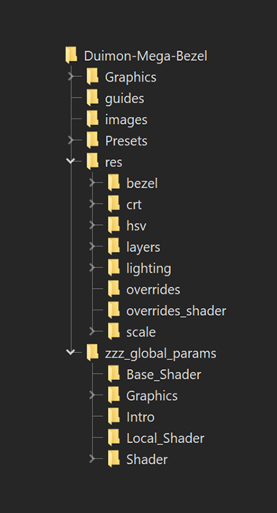

## Duimon boilerplate preset introduction.

This is intended to be a general Introduction to my new multiple reference (boilerplate) presets.
<br>
<br>
<hr>
<br>

First off let's define some terms so we understand each other.
#### Reference Lines.
This is a reference line.
```cpp
#reference "../../../zzz_global_params/Base_Shader/ADV.slangp"
```
#### Comments.
This pair of forward slashes...
```cpp
//
```
...is used to comment out lines so they will be ignored by the shader system when it compiles the preset. This syntax provides for description, instruction, and reference choices.

This is a commented out reference line.

```cpp
//#reference "../../../zzz_global_params/Base_Shader/ADV.slangp"
```
I will refer to the uncommented line as an "active" reference line.

We will talk more about the use of comments later.
#### Params files.
Most references in my boilerplate presets point to params files. i.e.
```cpp
#reference "../../../zzz_global_params/Intro/off.params"
```
In it's most basic form, a params file is just a simple slang shader preset with the reference line removed. The use of a distinct file extension serves to both avoid confusion and render them invisible while browsing for a preset in the Retroarch dialog. The file extension isn't a Retroarch requirement, it was adopted by the Mega Bezel team.
#### Local vs. Global
I will also be using the terms "local" and "global". Local refers to the individual preset and global refers to a large group or class of presets.
#### Example preset.
For this introduction I will be using my Advanced Acorn Archimedes "Bezel" preset as the example. It can be found in my presets folder.
```cpp
Duimon-Mega-Bezel\Presets\Advanced\Acorn_Archimedes\Archimedes-[ADV]-[Guest]-[Bezel].slangp.
```
<br>
<hr>
<br>

To begin with, let's talk about folder structure.

For those of you familiar with my pack, the "Presets" and "Graphics" folder (Except for a very few added, removed, or renamed files.) is exactly the same structure as the legacy presets. A few graphics that are shared among various presets have been moved to a new "_Common" folder.

There are some additional folders that are new. Let's take a look at the folder structure.



The "res" folder (Resource) has sub-directories that contain params files specific to shader parameter categories, the name of the folder reflects the category. Additionally there are two local override folders.

Now let's take a look at the example preset.

#### Duimon-Mega-Bezel\Presets\Advanced\Acorn_Archimedes\Archimedes-[ADV]-[Guest]-[Bezel].slangp


```cpp
// DUIMON MEGA BEZEL GRAPHICS AND PRESETS | https://duimon.github.io/Gallery-Guides/ | duimonmb@gmail.com
// SOME RIGHTS RESERVED - RELEASED UNDER CC BY NC ND LICENSE https://creativecommons.org/licenses/by-nc-nd/4.0/deed
// ----------------------------------------------------------------------------------------------------------------

// PRESET START
// ----------------------------------------------------------------------------------------------------------------

// SHADER :: CONNECTOR | Interface to Mega Bezel Presets folders.
// Edit the target file in the following reference to globally define the base preset.
// ----------------------------------------------------------------------------------------------------------------

#reference "../../../zzz_global_params/Base_Shader/ADV_Bezel.slangp"

// SHADER :: CONNECTOR :: LOCAL OVERRIDES | Interface to specific base presets.
// Comment out the top reference line and uncomment the following reference line to locally define the base preset.
// Keep in mind that some of the base presets use Integer Scale and may yield unexpected results. (e.g. Megatron)

//#reference "../../../zzz_global_params/Local_Shader/ADV_06.slangp"

// "ADV_06" matches the default "MBZ__1__ADV__GDV.slangp".
// Replace the "06" with any from the following list.
// 01. SMOOTH-ADV__GDV                  08. ADV__GDV-MINI-NTSC
// 02. SMOOTH-ADV__GDV-NTSC             09. ADV__GDV-NTSC
// 03. SMOOTH-ADV__MEGATRON             10. ADV__MEGATRON
// 04. SMOOTH-ADV__MEGATRON-NTSC        11. ADV__MEGATRON-NTSC
// 05. ADV__EASYMODE                    12. ADV-RESHADE-FX__GDV
// 06. ADV__GDV                         13. ADV-SUPER-XBR__GDV
// 07. ADV__GDV-MINI                    14. ADV-SUPER-XBR__GDV-NTSC

// INTRO | Intro animation
// ----------------------------------------------------------------------------------------------------------------

// ON
#reference "../../../zzz_global_params/Intro/on.params"
// ON - No Image
//#reference "../../../zzz_global_params/Intro/on_no_image.params"
// ON - Default Mega Bezel intro
//#reference "../../../zzz_global_params/Intro/on_default.params"
// OFF
//#reference "../../../zzz_global_params/Intro/off.params"

// DEVICE | Screen/Monitor/CRT/TV settings
// ----------------------------------------------------------------------------------------------------------------

// DEVICE :: BASE
#reference "../../../res/bezel/bezel.params"

// DEVICE :: SCALING
#reference "../../../res/scale/bezel.params"

// DEVICE :: CRT

// IMAGE LAYERS
// ----------------------------------------------------------------------------------------------------------------
#reference "../../../res/layers/bezel.params"
#reference "../../../res/layers/Acorn_Archimedes/bezel.params"

// HSV :: Hue, Saturation, and Value parameters
// ----------------------------------------------------------------------------------------------------------------
#reference "../../../res/hsv/Acorn_Archimedes/bezel.params"

// GRAPHICS OVERRIDES | Overrides for Image layers, scaling, etc 
// that are not related to Guest's shader. (Three examples are provided)
// These are restricted to [Bezel] versions and the following reference should be left commented out for others.
// ----------------------------------------------------------------------------------------------------------------

// GRAPHICS :: OVERRIDES
//#reference "../../../res/overrides/batocera.params"
//#reference "../../../res/overrides/batocera_nocurve.params"
//#reference "../../../res/overrides/batocera_hud.params"

// GLOBAL GRAPHICS :: OVERRIDES
// The user can edit the "user.params" to globally change the presets.
// To use community params that require another base preset, change the global base reference to match.
// Examples are included in the params file and commented out.
// These are also restricted to [Bezel] versions and the following reference should be left commented out for others.
#reference "../../../zzz_global_params/Graphics/user.params"

// The following is restricted to the [Custom-Bezel_002] presets.
// One example is included in the params file and commented out.
//#reference "../../../zzz_global_params/Graphics/user2.params"

// SHADER OVERRIDES | Place *.params references to Guest derivatives here. 
// (Make sure you are using ADV__GDV, STD__GDV, or POTATO__GDV base presets for variations on the Guest shader.)
// Two examples were kindly provided by guest.r. ;-)
// ----------------------------------------------------------------------------------------------------------------

// SHADER :: OVERRIDES
//#reference "../../../res/overrides_shader/guest_custom_aperture.params"
//#reference "../../../res/overrides_shader/guest_custom_slotmask.params"

// GLOBAL SHADER :: OVERRIDES
// The user can edit the "user.params" to globally change the presets.
// To use community params that require another base preset, change the global base reference to match.
// Examples are included in the params file and commented out.
// Separate folders let users change global settings on each of the sets.
// These are intentionally commented out for LCD-GRID presets.
#reference "../../../zzz_global_params/Shader/ADV/user_Bezel.params"
//#reference "../../../zzz_global_params/Shader/ADV_DREZ/user_Bezel.params"
//#reference "../../../zzz_global_params/Shader/STD/user_Bezel.params"
//#reference "../../../zzz_global_params/Shader/STD_DREZ/user_Bezel.params"
//#reference "../../../zzz_global_params/Shader/LITE/user_Bezel.params"

// AMBIENT LIGHTING
//#reference "../../../res/lighting/night.params"

// PRESET END
// ----------------------------------------------------------------------------------------------------------------
```
<br>

The first thing you may notice is that there are no parameters at all, only references to "params" files. 

Let's take a look at the file referenced by this line. This layers reference is one of a group of reference lines that coincide with the subfolders in the "res" folder.

```cpp
#reference "../../../res/layers/bezel.params"
```
Notice that the path is referencing a file in the "res/layers" folder named "bezel.params". "Layers" implies that it contains parameters involving Mega Bezel layers, and "bezel" coincides with my [BEZEL] subclass of presets. 

#### Duimon-Mega-Bezel/res/layers/bezel.params

```cpp
// DUIMON MEGA BEZEL GRAPHICS AND PRESETS | https://duimon.github.io/Gallery-Guides/ | duimonmb@gmail.com
// SOME RIGHTS RESERVED - RELEASED UNDER CC BY NC ND LICENSE https://creativecommons.org/licenses/by-nc-nd/4.0/deed
// ----------------------------------------------------------------------------------------------------------------

// IMAGE LAYER PARAMETERS
// Parameters specific to the image layers, excluding HSV parameters which are contained in the HSV params.
// ----------------------------------------------------------------------------------------------------------------


// BACKGROUND
// ----------------------------------------------------------------------------------------------------------------
HSM_BG_FILL_MODE = "1.000000"
HSM_BG_MIRROR_WRAP = "0.000000"

// LED
// ----------------------------------------------------------------------------------------------------------------
HSM_LED_OPACITY = "0.000000"
HSM_LED_FILL_MODE = "1.000000"

// DEVICE
// ----------------------------------------------------------------------------------------------------------------

// DEVICE LED
// ----------------------------------------------------------------------------------------------------------------

// CRT
// ----------------------------------------------------------------------------------------------------------------

// DECAL
// ----------------------------------------------------------------------------------------------------------------
HSM_DECAL_FOLLOW_LAYER = "2.000000"

// CABINET GLASS
// ----------------------------------------------------------------------------------------------------------------

// TOP EXTRA
// ----------------------------------------------------------------------------------------------------------------

// AMBIENT
// ----------------------------------------------------------------------------------------------------------------

// IMAGE PATHS
// ----------------------------------------------------------------------------------------------------------------
```
<br>
In this file the comment syntax is used only for description, and to define categories. This particular file is referenced by all my [Bezel] presets and contains parameters they all share. This params does not contain image paths, other files in the same root folder contain shared image paths. While reducing redundant code is one of my goals, this particular folder is an exception.
<br>
<br>
Within this folder there is a sub-directory for every system and a params file for every preset. (Even if the code is redundant.) Having one params file for each preset gives me complete control of the image layers and allows for future creative changes.
<br>
<br>

For an example of comment syntax used to control the active reference, let's take a look at this code at the beginning of the preset.

```cpp
// SHADER :: CONNECTOR | Interface to Mega Bezel Presets folders.
// Edit the target file in the following reference to globally define the base preset.
// ----------------------------------------------------------------------------------------------------------------

#reference "../../../zzz_global_params/Base_Shader/ADV_Bezel.slangp"

// SHADER :: CONNECTOR :: LOCAL OVERRIDES | Interface to specific base presets.
// Comment out the top reference line and uncomment the following reference line to locally define the base preset.
// Keep in mind that some of the base presets use Integer Scale and may yield unexpected results. (e.g. Megatron)

//#reference "../../../zzz_global_params/Local_Shader/ADV_06.slangp"

// "ADV_06" matches the default "MBZ__1__ADV__GDV.slangp".
// Replace the "06" with any from the following list.
// 01. SMOOTH-ADV__GDV                  08. ADV__GDV-MINI-NTSC
// 02. SMOOTH-ADV__GDV-NTSC             09. ADV__GDV-NTSC
// 03. SMOOTH-ADV__MEGATRON             10. ADV__MEGATRON
// 04. SMOOTH-ADV__MEGATRON-NTSC        11. ADV__MEGATRON-NTSC
// 05. ADV__EASYMODE                    12. ADV-RESHADE-FX__GDV
// 06. ADV__GDV                         13. ADV-SUPER-XBR__GDV
// 07. ADV__GDV-MINI                    14. ADV-SUPER-XBR__GDV-NTSC
```

There is one active reference which defines the base Mega Bezel preset.
```cpp
#reference "../../../zzz_global_params/Base_Shader/ADV_Bezel.slangp"
```

This is a global reference line that is shared by all the Advanced "Bezel" presets.

I have five standard subclasses in my presets; Bezel, Custom_Bezel_001, Custom_Bezel_002, PVM20, and TM20. Each of these has a matching global reference target.

The section below the active reference will let you define the base preset locally. I will focus on this more in another guide.

Let's examine the global reference path.

#### \Duimon-Mega-Bezel\zzz_global_params\Base_Shader\ADV_Bezel.slangp

The "Base_Shader" folder contains multiple slangp files. 

```cpp
ADV.slangp
ADV_Bezel.slangp
ADV_Bezel1.slangp
ADV_Bezel2.slangp
ADV_DREZ_1080.slangp
ADV_DREZ_240.slangp
ADV_DREZ_480.slangp
ADV_LCD.slangp
ADV_PVM20.slangp
ADV_TM20.slangp
LITE.slangp
LITE_Bezel.slangp
LITE_Bezel1.slangp
LITE_Bezel2.slangp
LITE_LCD.slangp
LITE_PVM20.slangp
LITE_TM20.slangp
STD.slangp
STD_Bezel.slangp
STD_Bezel1.slangp
STD_Bezel2.slangp
STD_DREZ_1080.slangp
STD_DREZ_240.slangp
STD_DREZ_480.slangp
STD_LCD.slangp
STD_PVM20.slangp
STD_TM20.slangp
```
<br>
There is a slangp file for every subclass and each of these files contains multiple references, let's take a look at the active reference target.

#### ADV_Bezel.slangp

```cpp
//#reference "../../../../shaders_slang/bezel/Mega_Bezel/Presets/Base_CRT_Presets/MBZ__0__SMOOTH-ADV__GDV.slangp"
//#reference "../../../../shaders_slang/bezel/Mega_Bezel/Presets/Base_CRT_Presets/MBZ__0__SMOOTH-ADV__GDV-NTSC.slangp"
//#reference "../../../../shaders_slang/bezel/Mega_Bezel/Presets/Base_CRT_Presets/MBZ__0__SMOOTH-ADV__LCD-GRID.slangp"
//#reference "../../../../shaders_slang/bezel/Mega_Bezel/Presets/Base_CRT_Presets/MBZ__0__SMOOTH-ADV__MEGATRON.slangp"
//#reference "../../../../shaders_slang/bezel/Mega_Bezel/Presets/Base_CRT_Presets/MBZ__0__SMOOTH-ADV__MEGATRON-NTSC.slangp"
//#reference "../../../../shaders_slang/bezel/Mega_Bezel/Presets/Base_CRT_Presets/MBZ__1__ADV__EASYMODE.slangp"
#reference "../../../../shaders_slang/bezel/Mega_Bezel/Presets/Base_CRT_Presets/MBZ__1__ADV__GDV.slangp"
//#reference "../../../../shaders_slang/bezel/Mega_Bezel/Presets/Base_CRT_Presets/MBZ__1__ADV__GDV-MINI.slangp"
//#reference "../../../../shaders_slang/bezel/Mega_Bezel/Presets/Base_CRT_Presets/MBZ__1__ADV__GDV-MINI-NTSC.slangp"
//#reference "../../../../shaders_slang/bezel/Mega_Bezel/Presets/Base_CRT_Presets/MBZ__1__ADV__GDV-NTSC.slangp"
//#reference "../../../../shaders_slang/bezel/Mega_Bezel/Presets/Base_CRT_Presets/MBZ__1__ADV__MEGATRON.slangp"
//#reference "../../../../shaders_slang/bezel/Mega_Bezel/Presets/Base_CRT_Presets/MBZ__1__ADV__MEGATRON-NTSC.slangp"
//#reference "../../../../shaders_slang/bezel/Mega_Bezel/Presets/Base_CRT_Presets/MBZ__1__ADV-RESHADE-FX__GDV.slangp"
//#reference "../../../../shaders_slang/bezel/Mega_Bezel/Presets/Base_CRT_Presets/MBZ__1__ADV-SUPER-XBR__GDV.slangp"
//#reference "../../../../shaders_slang/bezel/Mega_Bezel/Presets/Base_CRT_Presets/MBZ__1__ADV-SUPER-XBR__GDV-NTSC.slangp"
```
<br>
Changing the active reference will globally change the base preset for the entire preset subclass.

The opportunity to change the global or local base preset will be important in a subsequent section that has global and local shader overrides.

Let's move on to the next section of the preset to further explore the use of comments and references.

```cpp
// INTRO | Intro animation
// ----------------------------------------------------------------------------------------------------------------

// ON
#reference "../../../zzz_global_params/Intro/on.params"
// ON - No Image
//#reference "../../../zzz_global_params/Intro/on_no_image.params"
// ON - Default Mega Bezel intro
//#reference "../../../zzz_global_params/Intro/on_default.params"
// OFF
//#reference "../../../zzz_global_params/Intro/off.params"
```
The active reference line...
```cpp
#reference "../../../zzz_global_params/Intro/on.params"
```
...defines the behavior of the intro animation. Changing the active reference will define the behavior locally.

To explore further, let's open the "on.params" in the active local reference.

#### Duimon-Mega-Bezel/zzz_global_params/Intro/on.params

```cpp
// DUIMON MEGA BEZEL GRAPHICS AND PRESETS | https://duimon.github.io/Gallery-Guides/ | duimonmb@gmail.com
// SOME RIGHTS RESERVED - RELEASED UNDER CC BY NC ND LICENSE https://creativecommons.org/licenses/by-nc-nd/4.0/deed
// ----------------------------------------------------------------------------------------------------------------

// INTRO PARAMETERS
// Parameters specific to the intro sequence.
// Comment out all for the default Mega Bezel intro.
// ----------------------------------------------------------------------------------------------------------------


// OFF :: NO INTRO
// ----------------------------------------------------------------------------------------------------------------
//HSM_INTRO_WHEN_TO_SHOW = "0.000000"


// ON :: DUIMON INTRO
// ----------------------------------------------------------------------------------------------------------------
HSM_INTRO_WHEN_TO_SHOW = "1.000000"
IntroImage = "../../Graphics/_Common/Duimon_OSD.png"


// ON :: NO IMAGE
// ----------------------------------------------------------------------------------------------------------------
//HSM_INTRO_LOGO_BLEND_MODE = "0.000000"
```
<br>

Unlike the local references, here (By choosing which parameters are active.) the intro behavior can be defined globally for the entire pack. In addition, the image path can be changed to point to a new image and the change will effect all presets that have the intro enabled. (There are a few systems with screens too small to make sense having an intro.)

This local and global system continues here, in the first of two override sections.

```cpp
// GRAPHICS OVERRIDES | Overrides for Image layers, scaling, etc 
// that are not related to Guest's shader. (Three examples are provided)
// These are intended for [Bezel] versions and the following reference should be left commented out for others.
// ----------------------------------------------------------------------------------------------------------------

// GRAPHICS :: OVERRIDES
//#reference "../../../res/overrides/batocera.params"
//#reference "../../../res/overrides/batocera_nocurve.params"
//#reference "../../../res/overrides/batocera_hud.params"

// GLOBAL GRAPHICS :: OVERRIDES
// The user can edit the "user.params" to globally change the presets.
// These are for the bezel, frame, and other graphic attributes.
// Examples are included in the params file and commented out.
// These are also intended for [Bezel] versions and the following reference should be left commented out for others.
#reference "../../../zzz_global_params/Graphics/user.params"

// The following is restricted to the [Custom-Bezel_002] presets.
// One example is included in the params file and commented out.
//#reference "../../../zzz_global_params/Graphics/user2.params"
```

There is a section description at the top, followed by some commented local override references, an active global override reference, ending with an inactive reference for the Custom_Bezel_002 subclass.

The example local reference params are extracted from the presets I used to generated decorations for my Batocera project. Each line references a params file that will change parameters having to do with the bezel. (Scale, curvature, frame thickness, bezel height etc.) By choosing which line to comment, changes can be made to each preset locally.

My intent is to allow the user to add there own params files to the same folder and add active reference lines here. They are not limited to the bezel and scale changes provided by the example params, but my intent was for any params related to the CRT shader to be in the second override section.

Note that these options are more directly targeted at preset developers using the boilerplate, it may be preferable for most users to add external references to a saved preset. I will discuss the benefits of both methods in another guide.

Now let's examine the "user.params" in the active global reference.

#### Mega_Bezel_Community/Duimon-Mega-Bezel/zzz_global_params/Graphics/user.params

```cpp
// DUIMON MEGA BEZEL GRAPHICS AND PRESETS | https://duimon.github.io/Gallery-Guides/ | duimonmb@gmail.com
// SOME RIGHTS RESERVED - RELEASED UNDER CC BY NC ND LICENSE https://creativecommons.org/licenses/by-nc-nd/4.0/deed
// ----------------------------------------------------------------------------------------------------------------

// GLOBAL GRAPHGICS :: BEZEL
// Custom Parameters specific to the [Bezel] presets.
// ----------------------------------------------------------------------------------------------------------------


//#reference "/params/batocera.params"
//#reference "/params/batocera_nocurve.params"
//#reference "/params/batocera_hud.params"
```
<br>
As you can see it contains the same references as the local overrides in the previous example. By choosing which line to make active, the change can be applied to all the presets that have this particular active reference. In this case my intention was to allow for global changes to the bezel and frame style, so only the [Bezel] presets have this reference line active. (Very strange things would happen to my PVM presets if they shared this active reference.)
<br>
<br>
The user can add their own active reference line to this file, pointing to a custom personal params file, and apply it to all the [Bezel] presets. Keep in mind that any bezel color parameters will be applied to all the presets. If the goal is to maintain the colors I have chosen, then omit any bezel HSV (Hue, Saturation, and Value.) parameters.

<br>
Next, let's take a look at the second override section.
<br>

```cpp
// SHADER OVERRIDES | Place *.params references to Guest derivatives here. 
// (Make sure you are using ADV__GDV, STD__GDV, or POTATO__GDV base presets for variations on the Guest shader.)
// Two examples were kindly provided by guest.r. ;-)
// ----------------------------------------------------------------------------------------------------------------

// SHADER :: OVERRIDES
//#reference "../../../res/overrides_shader/guest_custom_aperture.params"
//#reference "../../../res/overrides_shader/guest_custom_slotmask.params"

// GLOBAL SHADER :: OVERRIDES
// The user can edit the target params file to globally change the presets.
// To use community params that require another base preset, change the global base reference to match.
// Examples are included in the params file and commented out.
// Separate folders let users change global settings on each of the sets.
// These are intentionally commented out for LCD-GRID presets.
#reference "../../../zzz_global_params/Shader/ADV/user_Bezel.params"
//#reference "../../../zzz_global_params/Shader/ADV_DREZ/user_Bezel.params"
//#reference "../../../zzz_global_params/Shader/STD/user_Bezel.params"
//#reference "../../../zzz_global_params/Shader/STD_DREZ/user_Bezel.params"
//#reference "../../../zzz_global_params/Shader/LITE/user_Bezel.params"
```
<br>
The previous logic applies to this code, though in this case the global overrides are specific to the local preset subclass. The target reference can be changed to globally effect each class. (Leaving the commented lines of text is central to the "Boilerplate" model, making it easy to create new presets that share the same class or sub class, and make small changes that affect many presets.)
<br>
My intention here was to use params extracted from standalone Guest ADV presets or derivatives. If the goal is to use Mega Bezel derivatives I strongly suggest doing it locally (So any needed tweaks can be made on the fly.) or restricting them to the [Bezel] subclass.

While it is possible to use Mega Bezel derivatives as an override for other presets, the use of scale, bezel, or curvature parameters may yield unexpected results. Parameters that cause issues will have to be eliminated. Alternatively, they can be compensated for by using either an additional params reference...

e.g. (From the example preset.)
```cpp
// IMAGE LAYERS
// ----------------------------------------------------------------------------------------------------------------
#reference "../../../res/layers/bezel.params"
#reference "../../../res/layers/Acorn_Archimedes/bezel.params"
```

...or the use of external parameters.

___

Lastly we have the ambient lighting section.

```cpp
// AMBIENT LIGHTING
//#reference "../../../res/lighting/night.params"
```
The ambient light can be enable by uncommenting the reference line. This makes it super simple for me to convert a day preset to a night preset. There are a few different target files in the same folder, depending on the needs of the local preset.
<br>
<br>
<hr>
<br>

In closing I would like to add that after a brief period of expected bug squashing, any changes to existing presets should be limited to files in the "res" folder. The main presets, the global params folders, and the local override folders within the res folder, should remain unchanged.

This means that you are free to make any local or global reference changes and as long as you install and update using the GitHub method, your changes should survive an update.

I also understand that this may seem overly complex. Keep in mind that creating these multiple reference presets has already allowed me to make some dramatic sweeping changes to my PVM20 presets that the limits of my legacy presets prevented me from doing for over a year. I am excited to see how the templates grow as HyperspaceMadness adds features to both the shader an Retroarch.


