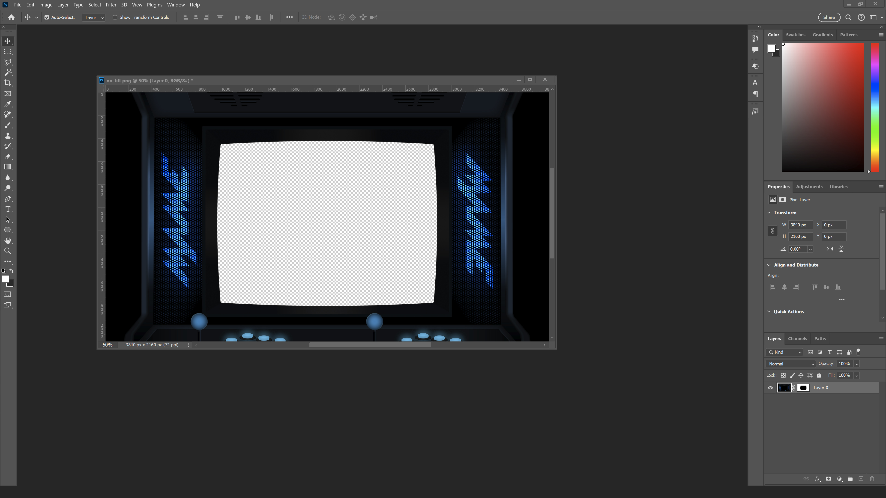
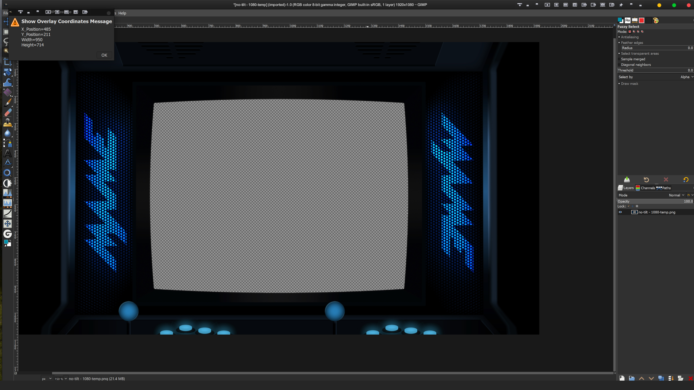

## Creating An Overlay From A Mega Bezel Preset.

This guide will walk you through using a Mega Bezel preset, an image editor, and tools within the Mega Bezel to create a standard overlay. It will also include various methods to help set up the overlays in RetroArch.

I will assume you have at least some experience using an image editor. (An introduction to image editing is beyond the scope of this guide.)

For this guide we will be using my MAME Cabinet no-tilt standard preset... (\Duimon-Mega-Bezel\Presets\Standard\MAME\MAME-[STD]-[Guest][CABINET][NO TILT].slangp)

...and my tilted cabinet preset. (\Duimon-Mega-Bezel\Presets\Standard\MAME\MAME-[STD]-[Guest][CABINET].slangp)

The last part of the guide will deal with setting up the tilted version with the CRT-Geom shader. (\shaders\shaders_slang\crt\crt-geom.slangp)

**Note.** I am using the "glui" menu driver with 0% background opacity. This setup allows me to clearly see the results of any parameter changes I make.
<br>
<br>
<br>

___

### 1. Collecting Assets
<br>

To begin we will run 1944 with the MAME core and load the preset.


Next, press "F1" or the "Home" button on your controller to call up the Retroarch menu. Then navigate to the shader parameters dialog.

There are a LOT of parameters. For this task I press the "S" key on the keyboard to call up the search dialog, type in "simp", and press the enter key. 


This will bring us to the relevant section. (As you gain experience with the Mega Bezel you can acquire more useful search snippets.)


Our first task is to adjust the mode to "BLACK-SCREEN", Press "F1" to return to the game, and "F8" to take a GPU screenshot.

Next we will return to the shader parameters and change the mode to "BW-MASK".

We have a few choices for a mask type. (You can cycle through the options to see what they do.) Since my presets make use of the shader's "Screen Black Edge" feature, we need to select the "Tube" mask so that our mask lines up with the bezel edge. 


"Screen" would line up with the inside of the "Screen Black Edge" if the use case requires it.

Press "F1" again to return to the game, and "F8" to get another screenshot.

Now we have two assets we can use in an image editor, a shot of the graphic and a mask to define the hole for the screen.

Next we'll open them in  an image editor.

Retroarch names the screen captures using the ROM name and a time stamp. When I converted all my presets into overlays I renamed the masks and images to help keep track of them. Since my CRT presets all share a set of five identical screen sizes, I named my masks to reflect the presets and added them to my library of assets. For future additions to my collection I can use the saved masks and skip the above mask step.

Your goals will define your workflow.

<br>

___

### 2. Using The Assets In Adobe Photoshop
<br>

My image editor of choice is Adobe Photoshop so we will start there.

Open Photoshop and load both images.


The first step is to focus on the mask image, press "Ctrl+A" to select all, and "Ctrl+C" to copy it to the clipboard. You can close the mask document. 

Next, add a mask to the second image.


The new mask will be automatically selected in the layers palette.


Alt+Click the mask thumbnail (In the layers palette.) to switch to mask mode, and press "Ctrl+Shift+V" to "Paste in Place" from the clipboard.


Click the image layer thumbnail (To the left of the mask in the layers palette.) to switch to the image view.



At this point you can save the project as a PNG and you have an overlay. I recommend saving a PSD first, just in case you have issues (e.g. mame_no-tilt.psd) then saving a PNG. If you are following my workflow you now have three images. (mame_mask.png, mame.png, and mame_no-tilt.psd)

Going back to the open PSD document. I like to add a drop shadow to the the entire image.


___

Since I do this operation quite often. I have created a couple of PhotoShop actions to make it easier.

The first action is used instead of creating a new mask in the above step. By pressing "Shift+Ctrl+F11" a mask is created and the contents of the clipboard pasted in place, in a single step.

I also have a drop shadow "Style" that is for 4k projects.

These can be found in my "Front-End-Assets" repo, in a "Tools" folder. There are additional files (Including a second action.) that are beyond the scope of this guide.

<br>

___

### 3. Using The Assets In GIMP
<br>

Many users don't have access to Photoshop. Next I will walk you through using GIMP. GIMP is a cross-platform open source alternative image editor.

For this example I will be using the tilted version of my MAME preset. I used the same method as above to acquire the assets.

Assuming you have GIMP installed, open both of your source images.

** **Note** ** (I am using the "PhotoGIMP" mod to change the layout and hotkeys for GIMP to more closely resemble Photoshop. Your layout and keys may be different.)


Using the image tabs at the top, switch to the mask image.


Press "Ctrl+A" to select all and "Ctrl+C" to copy the selection to the clipboard. Then use the image tabs to switch to the other image.

Creat a new layer and press "CTRL+V" to paste in the contents of the clipboard.


You will have a "Floating Selection". Click anywhere outside the canvas to anchor the selection.


Using the "Fuzzy Selection" tool, click in the black color to select it.


In the layers panel, select the second layer, (The MAME graphic.) and right-click to bring up the context menu. Click on "Add Layer Mask".


Once the "Add Layer MAsk" dialog opens, use the illustrated settings.


Make sure "selection" and "Invert Mask" are checked, then press "Add".

At this point you can save the file to a new name. If you want to add a drop shadow you will first have to apply the layer mask.


Go the the "Filters" menu at the top and find the drop shadow menu item.


In the new dialog you can use my settings or create your own and press the "OK" button.


Once you are done, save to a new filename as above.

<br>

___

### 3. Getting Retroarch Custom Aspect Coordinates
<br>

When you set up an overlay in Retroarch you need to use custom aspect coordinates. Historically the method is either trial and error, or done live in the menu. I get my coordinates in an image editor and manually create overrides. Here I will detail two methods of getting coordinates in free image editors.

FYI, to use Photoshop to get coordinates you have to do math, so I don't recommend using it for this task.

First we will use `Paint.NET`, a relatively low featured but useful free image editor.

Open your completed overlay in `Paint.NET`.


Using the "Magic Wand" select the transparent part of the image. Since we have a drop shadow, you will have to use the "Tolerance" slider at the top until the whole area is selected.

The coordinates will be displayed in the lower left corner of the window.


** **Note** ** This method will work for almost any community overlay. If your workflow only includes converting Mega Bezel presets, you could simply use the mask image to get the coordinates. 

Next we will get the coordinates from GIMP.

To do this we will first have to install my customized Python plugin. It, and installation instructions, can be found in the Tools folder in the above mentioned repo.

Open your completed overlay in GIMP.


Using the "Fuzzy Select" tool, select the transparent part of the image. In the upper right hand corner you need to use the "Threshold" slider (Much like the "Tolerance" slider in Paint.NET) to get the entire area.

Right click in the selection area to bring up the context menu and click the "Select>>Show Overlay Coordinates" button.


The coordinates will be displayed in a new dialog.



We are using a 4k image so the coordinates will reflect that.


If your target screen is 1920x1080 you will have to, at least temporarily, resize your image to that resolution. If you are doing it temporarily, you can resize it now in GIMP, get your coordinates, and close the image without saving it.

The new coordinates will be different from the last, reflecting the smaller image size.


Retroarch can use 4k overlays on a 1080 screen as long as the coordinates are correct for that resolution. If you need to permanently resize your image for any reason, (e.g To save space.) I recommend using an application that can use the "Mitchell" method, such as FastStone Image Viewer.


For a free alternative you can use the ImageMagick mogrify.exe with the following command line.

```cpp
-filter Mitchell -resize 1920x1080 -format png
```

<br>

___

### 4. Creating a CFG for the overlay.
<br>

An overlay CFG is (In it's simplest form.) is a basic text file pointing to the PNG image. The simple format is as follows.

```cpp
overlays = 1

overlay0_overlay = mame.png

overlay0_full_screen = true

overlay0_descs = 0
```

Create a text file with these contents. Name the file with the same filename as your overlay and a CFG file extension. (e.g. mame.cfg)

<br>

___

### 4. Creating a custom override.
<br>

Before creating an override, you need to put your overlay somewhere sensible. (e.g. Retroarch\overlays\mycustom\mame\mame.cfg) Both the PNG and the CFG will be needed.

Since we are using a MAME overlay, I will create an override for the MAME core.

Navigate to your Retroarch config folder. (Retroarch\config" by default.) If you have used the MAME core at least once, you will have a MAME folder containg at least a default MAME.opt file.

In the "config\MAME" folder, create a new text file, named 1944.cfg, with the following contents.

```cpp
aspect_ratio_index = "23"
custom_viewport_height = "1430"
custom_viewport_width = "1904"
custom_viewport_x = "968"
custom_viewport_y = "421"
input_overlay = "..\overlays\mycustom\mame\mame.cfg"
input_overlay_enable = "true"
input_overlay_opacity = "1.000000"
input_overlay_hide_in_menu = "false"
input_overlay_behind_menu = "true"
```

The "aspect_ratio_index" of 23 means "Custom".

The coordinates in the next four lines are from the GIMP exercise above.

In this example I am assuming the Retroarch "config" and "overlay" folders are within the same parent folder, so I am using the `..\` relative path syntax. You may need to change and/or use direct paths.

I highly recommend the last two settings to make it easier to work with overlays within the Retroarch menu.

The rest of the lines should be self explanatory.

<br>

___

### 5. Configuring The CRT-Geom Shader With The Tilted Overlay.
<br>

The first thing we need is a titled overlay. We can follow the above directions for the overlay and overlay CFG file. To keep things simple I placed the overlay in the root "overlays" folder.

The cfg reads...

```
overlays = 1

overlay0_overlay = mame-tilt.png

overlay0_full_screen = true

overlay0_descs = 0
```

The **\config\MAME\1944.cfg** override reads...

```
aspect_ratio_index = "23"
custom_viewport_height = "1395"
custom_viewport_width = "1952"
custom_viewport_x = "944"
custom_viewport_y = "464"
input_overlay = ":/overlays/mame-tilt.cfg"
input_overlay_enable = "true"
input_overlay_opacity = "0.700000"
input_overlay_hide_in_menu = "false"
input_overlay_behind_menu = "true"
```

** **Note** ** I intentionally used the "0.70000" value for overlay opacity so we can see the game screen behind the overlay. We will need to adjust some shader parameters with a clear view of the screen.

Now we can run 1944.


The first thing I see is that the overlay is so dark we will have a hard time telling the game screen from the bezel edge. Since we have a tilted Black & White mask in our assets I quickly converted a copy to use as a temporary guide. (I named in tilt_mask2.png and temporarily changed the config to point to it.)

```
overlays = 1

overlay0_overlay = tilt_mask2.png

overlay0_full_screen = true

overlay0_descs = 0
```

Then I loaded the CRT-Geom shader.


I changed the Corner Size to 0.00 and adjusted the Vertical Tilt.


There are some black bars at the top and bottom. First, I saved a game preset, then I captured a shot, measured the pixels, and increased the viewport height by 48 pixels. (24 X 2) The new override reads...

```
aspect_ratio_index = "23"
custom_viewport_height = "1443"
custom_viewport_width = "1952"
custom_viewport_x = "944"
custom_viewport_y = "440"
input_overlay = ":/overlays/mame-tilt.cfg"
input_overlay_enable = "true"
input_overlay_opacity = "0.700000"
input_overlay_hide_in_menu = "false"
input_overlay_behind_menu = "true"
```

If you read carefully you'll see I also added 24 pixels to the "custom_viewport_y" value to split the difference. 

** **Note** ** You can adjust the aspect values in the RA menu but I find it cumbersome to update a config live.

Now when we run 1944 we get this.


Not bad. :-)

If we use the CRT-Geom_Deluxe shader it looks almost perfect.


Either way, edit the overlay CFG to point to the mame_tilt.png, and the override overlay opacity to "1.00000" and we end up with this.


The crt-geom simple preset reads...

```
#reference ":/shaders/shaders_slang/crt/crt-geom.slangp"
cornersize = "0.001000"
y_tilt = "-0.230000"
```

The crt-geom-deluxe...

```
#reference ":/shaders/shaders_slang/crt/crt-geom-deluxe.slangp"
R = "2.600001"
d = "1.500000"
angle_y = "-0.230000"
```

As you can see, setting up a tilted shader in Retroarch with an overlay can be tricky. Using my methods for a regular overlay is fairly easy but sometimes you just have to get your hands dirty. ;-)

The two main inspirations behind the Mega Bezel was the reflection (Because reflections are cool.) and eliminating the pain and suffering of setting up overlays.

In closing, let me add that dual screen coordinates can also be acquired using the above methods, including separate screen coordinates for the new MelonDS touch screen settings.

Have fun gaming! :-)

