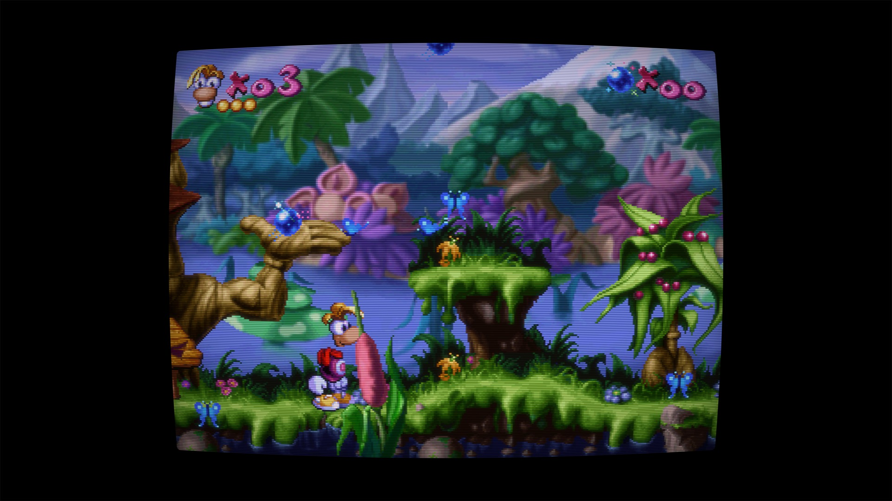
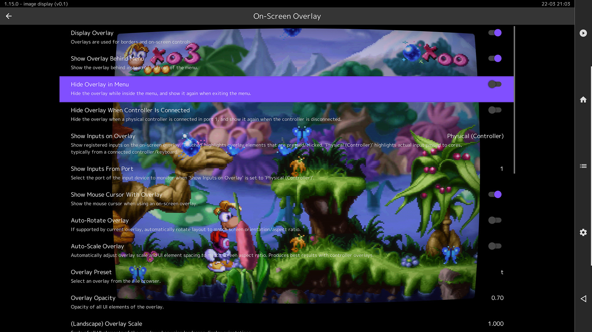
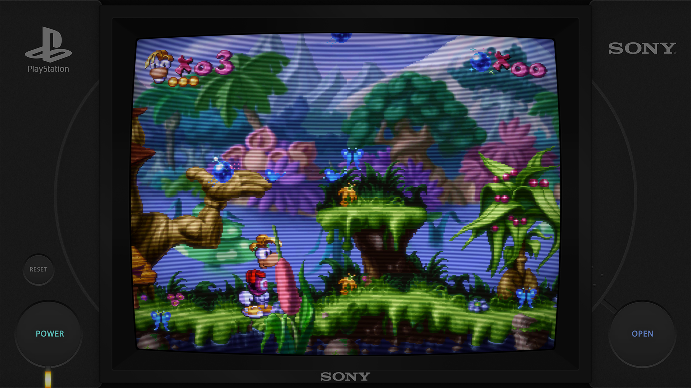

### Overlay Hybrid Setup

---

This guide will show how to use the Screen Only base preset in my Standard presets, and combine them with my overlays.

(For this guide I am going to assume the user is familiar with loading and saving a shader preset.)

The STD Screen Only presets are much more performant than anything other than the Potato presets. In addition, if we use them in concert with an overlay, we can change the aspect to 4x3 (Instead of the usual mandatory Full aspect.) This reduces the size of the viewport by 40% and yields even better performance.

This gives us access to many more features than those available in the Potato presets, (Tube Diffuse, Tube Gel, Tube Shadow, Empty Tube Space, etc.) while still allowing the shader to run on a lower end GPU.

---

First we will globally enable the Screen Only base preset in my Standard presets.

Navigate to the ```\Duimon-Mega-Bezel\zzz_global_params\Base_Shader``` folder. We will be editing the STDXXXX.slangp subclass files. There are no DREZ Screen Only base presets so we can ignore those. This leaves:

* STD.slangp
* STD_Bezel.slangp
* STD_Bezel1.slangp
* STD_Bezel2.slangp
* STD_LCD.slangp
* STD_PVM20.slangp
* STD_TM20.slangp

The method is the same for each subclass preset file. Let's look at STD.slangp.

#### \Duimon-Mega-Bezel\zzz_global_params\Base_Shader\STD.slangp

```cpp
// DUIMON MEGA BEZEL GRAPHICS AND PRESETS | https://duimon.github.io/Gallery-Guides/ | duimonmb@gmail.com
// SOME RIGHTS RESERVED - RELEASED UNDER CC BY NC ND LICENSE https://creativecommons.org/licenses/by-nc-nd/4.0/deed
// ----------------------------------------------------------------------------------------------------------------

// BASE SHADER REFERENCES
// INSURE THAT THE BASE SHADER MATCHES THAT OF ANY GLOBAL PARAMS YOU USE
// ----------------------------------------------------------------------------------------------------------------


// STANDARD :: For regular setup.
// ----------------------------------------------------------------------------------------------------------------

//#reference "../../../../shaders_slang/bezel/Mega_Bezel/Presets/Base_CRT_Presets/MBZ__3__STD__EASYMODE.slangp"
#reference "../../../../shaders_slang/bezel/Mega_Bezel/Presets/Base_CRT_Presets/MBZ__3__STD__GDV.slangp"
//#reference "../../../../shaders_slang/bezel/Mega_Bezel/Presets/Base_CRT_Presets/MBZ__3__STD__GDV-NTSC.slangp"
//#reference "../../../../shaders_slang/bezel/Mega_Bezel/Presets/Base_CRT_Presets/MBZ__3__STD__MEGATRON.slangp"
//#reference "../../../../shaders_slang/bezel/Mega_Bezel/Presets/Base_CRT_Presets/MBZ__3__STD__MEGATRON-NTSC.slangp"
//#reference "../../../../shaders_slang/bezel/Mega_Bezel/Presets/Base_CRT_Presets/MBZ__3__STD-SUPER-XBR__GDV.slangp"
//#reference "../../../../shaders_slang/bezel/Mega_Bezel/Presets/Base_CRT_Presets/MBZ__3__STD-SUPER-XBR__GDV-NTSC.slangp"

// STANDARD NO-REFLECT :: For performant setup.
// ----------------------------------------------------------------------------------------------------------------

//#reference "../../../../shaders_slang/bezel/Mega_Bezel/Presets/Base_CRT_Presets/MBZ__4__STD-NO-REFLECT__EASYMODE.slangp"
//#reference "../../../../shaders_slang/bezel/Mega_Bezel/Presets/Base_CRT_Presets/MBZ__4__STD-NO-REFLECT__GDV.slangp"
//#reference "../../../../shaders_slang/bezel/Mega_Bezel/Presets/Base_CRT_Presets/MBZ__4__STD-NO-REFLECT__GDV-NTSC.slangp"
//#reference "../../../../shaders_slang/bezel/Mega_Bezel/Presets/Base_CRT_Presets/MBZ__4__STD-NO-REFLECT__MEGATRON.slangp"
//#reference "../../../../shaders_slang/bezel/Mega_Bezel/Presets/Base_CRT_Presets/MBZ__4__STD-NO-REFLECT__MEGATRON-NTSC.slangp"
//#reference "../../../../shaders_slang/bezel/Mega_Bezel/Presets/Base_CRT_Presets/MBZ__4__STD-NO-REFLECT-SUPER-XBR__GDV.slangp"
//#reference "../../../../shaders_slang/bezel/Mega_Bezel/Presets/Base_CRT_Presets/MBZ__4__STD-NO-REFLECT-SUPER-XBR__GDV-NTSC.slangp"

// SCREEN ONLY :: For hybrid overlay setup.
// ----------------------------------------------------------------------------------------------------------------

//#reference "../../../../shaders_slang/bezel/Mega_Bezel/Presets/Base_CRT_Presets/MBZ__4__STD-SCREEN-ONLY__EASYMODE.slangp"
//#reference "../../../../shaders_slang/bezel/Mega_Bezel/Presets/Base_CRT_Presets/MBZ__4__STD-SCREEN-ONLY__GDV.slangp"
//#reference "../../../../shaders_slang/bezel/Mega_Bezel/Presets/Base_CRT_Presets/MBZ__4__STD-SCREEN-ONLY__GDV-MINI.slangp"
//#reference "../../../../shaders_slang/bezel/Mega_Bezel/Presets/Base_CRT_Presets/MBZ__4__STD-SCREEN-ONLY__GDV-MINI-NTSC.slangp"
//#reference "../../../../shaders_slang/bezel/Mega_Bezel/Presets/Base_CRT_Presets/MBZ__4__STD-SCREEN-ONLY__GDV-NTSC.slangp"
//#reference "../../../../shaders_slang/bezel/Mega_Bezel/Presets/Base_CRT_Presets/MBZ__4__STD-SCREEN-ONLY__MEGATRON.slangp"
//#reference "../../../../shaders_slang/bezel/Mega_Bezel/Presets/Base_CRT_Presets/MBZ__4__STD-SCREEN-ONLY__MEGATRON-NTSC.slangp"
//#reference "../../../../shaders_slang/bezel/Mega_Bezel/Presets/Base_CRT_Presets/MBZ__4__STD-SCREEN-ONLY-SUPER-XBR__GDV.slangp"
//#reference "../../../../shaders_slang/bezel/Mega_Bezel/Presets/Base_CRT_Presets/MBZ__4__STD-SCREEN-ONLY-SUPER-XBR__GDV-NTSC.slangp"
```

While there are a lot of choices in the ```// STANDARD :: For regular setup.``` section, the only uncommented reference points to the ```MBZ__3__STD__GDV.slangp``` base preset.

Comment that line out by adding // before it.

Scroll down to the ```// SCREEN ONLY :: For hybrid overlay setup.``` section and uncomment the line pointing to the ```MBZ__4__STD-SCREEN-ONLY__GDV.slangp``` base preset.

Save the file and repeat the process for the remaining files. (Or only the subclasses you want to use.)

---

For the next step you will need to download my overlays. They can be found in my overlay repo.  [https://github.com/Duimon/Retroarch-Overlays](https://github.com/Duimon/Retroarch-Overlays)

We really only need the "Logo" folder from the repo. Once you have everything downloaded, copy the Logo folder into yor "Retroarch/overlays" folder. To keep things tidy I recommend "Retroarch/overlays/Duimon/Logo".

___

Here is when it gets cool. :-)

Now open some content and a preset. (e.g.Rayman on the Beetle_PSX_HW core, and ```\Duimon-Mega-Bezel\Presets\Standard\SONY_Playstation\Playstation_Alt-[STD]-[Guest]-[Bezel].slangp```).



Save a core or game preset.

Next enable overlays in >Settings>On-Screen Overlay.



I also recommend disabling "Hide Overlay in Menu" and enabling "Show Overlay Behind Menu".

Make sure to change the Overlay Opacity to 1.00 (0.70 is the default.)

Scroll down to "Overlay Preset" and browse to the ```\overlays\Duimon\Logo\SONY_Playstation\Playstation_Alt.cfg``` file to load my Playstation Alternate overlay.



If you have ever set up an overlay you will notice that we didn't have to change any settings to make the screen fit the overlay. With this setup, all the scaling is done by the shader.

Finally, go to ```>Settings>Video>Scaling>Aspect Ratio``` and change the aspect ratio to 4x3.

You shouldn't see any change. :-)

Go to ```>Quick Menu>Overrides``` and save a core or game override. (Depending on which type of preset you saved earlier.)

Alternatively, you can manually create a ```\config\Beetle PSX HW\Beetle PSX HW.cfg``` file with these contents.

```cpp
input_overlay = ":/overlays/Duimon/Logo/SONY_Playstation/Playstation_Alt.cfg"
input_overlay_behind_menu = "true"
input_overlay_enable = "true"
input_overlay_hide_in_menu = "false"
input_overlay_opacity = "1.000000"
```

Once you get the hang of it, I find that manually creating the files is much faster than using the menu. You can create core, game, or content directory overrides by just using the core, game, or content directory name for the cfg file.

This method should work for the vast majority of my presets and overlays. For the dual screen overlays, make sure you use the overlay with "Hybrid" in the name. The others are created for use without the shader, and suffer for the lack of it's features.

___

Done! :-) Have fun!


