### User Created Params Files.

---

This guide will walk you through creating your own custom params files for use in my presets.

(For this series of guides I am going to assume the user is familiar with loading and saving a shader preset.)
<br>
<br>
<hr>

#### ** A note on my RA settings **


I am using the "glui" menu driver with the framebuffer opacity set to "0.00"

---

<br>
For the example preset I will be using my Playstation Alternate "Bezel" preset. If you are following along, make a backup of the example preset first.
<br>
<br>

```cpp
Duimon-Mega-Bezel\Presets\Advanced\SONY_Playstation\Playstation_Alt-[ADV]-[Guest]-[Bezel].slangp
```
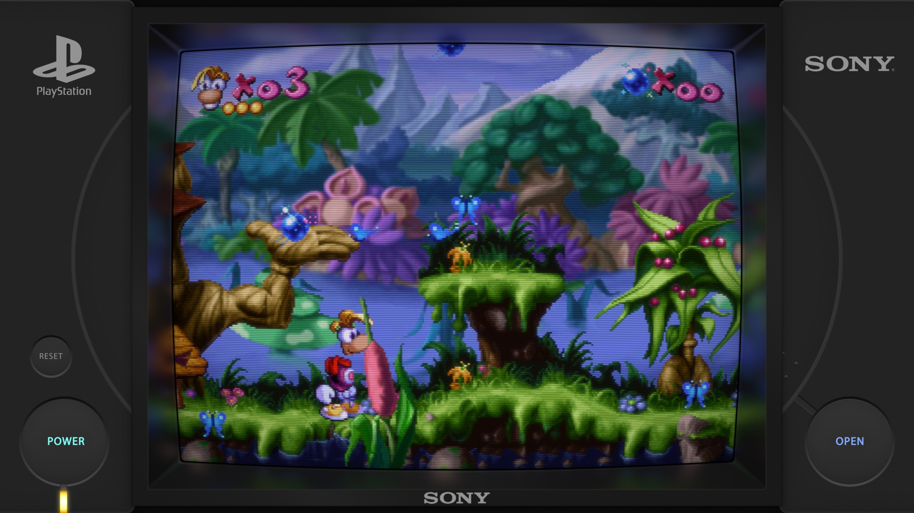


Note that I am using 4K resolution and the screenshots have been resized to 1080 and converted to JPG. (Some details will be degraded.)
<br>

---

<br>

Load your content and the example preset.

First we'll change the Frame Thickness to "50.00".

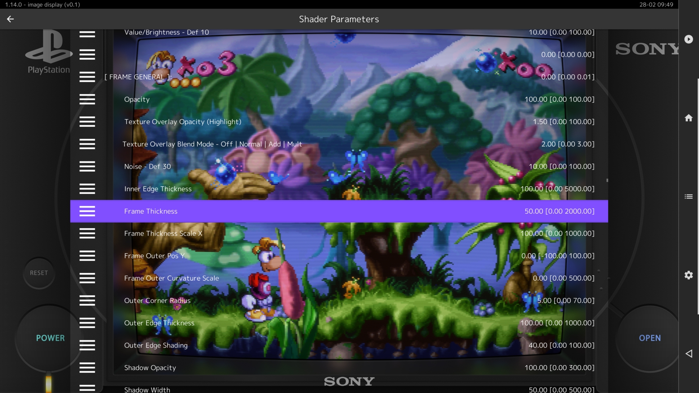

#### ** A note on Bezel Color **

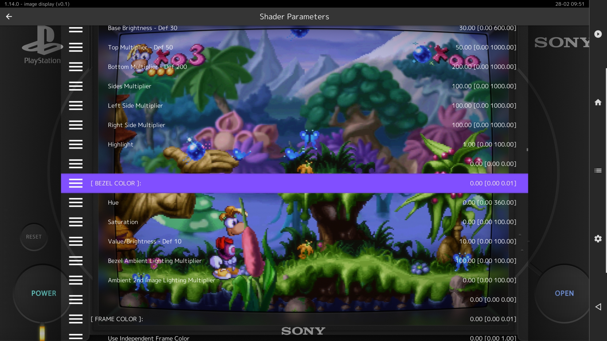

You are free to change the bezel/frame color but keep in mind that if we use the resulting params as a global reference, it will override my default bezel colors. I will not be changing the color in this guide.

Next we'll change the bezel Width to "80.00" and Height to "70.00".

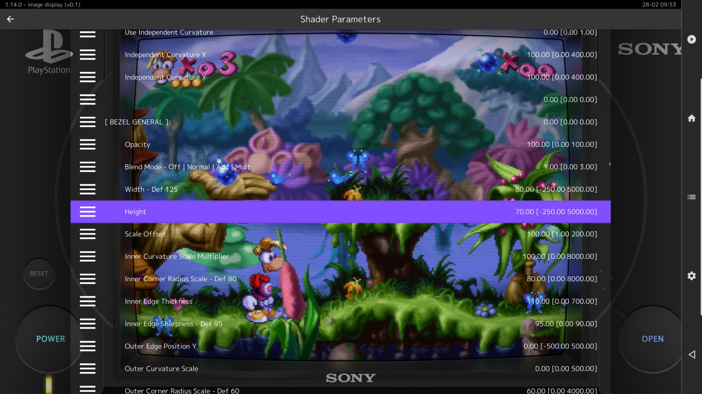

Then the Non-Integer Scale to "88.77".

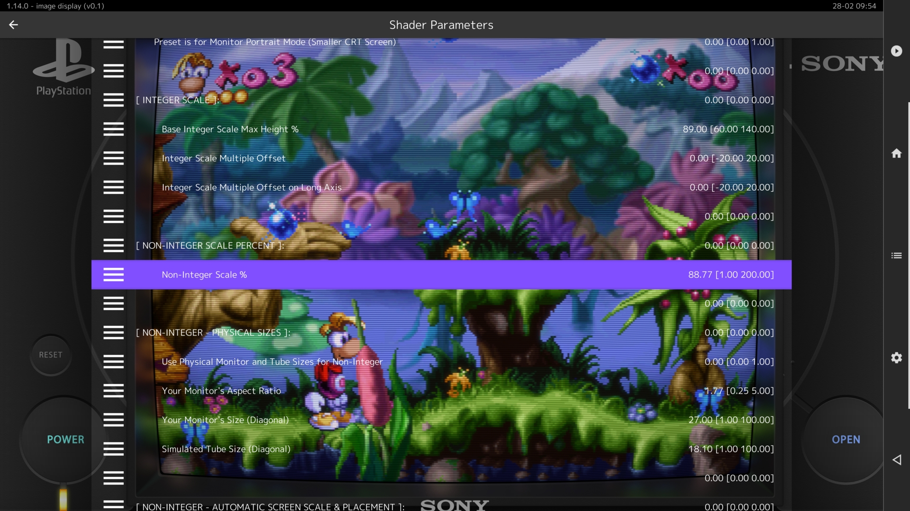

The Decal no longer makes sense, so we'll change it's opacity to "0.00".

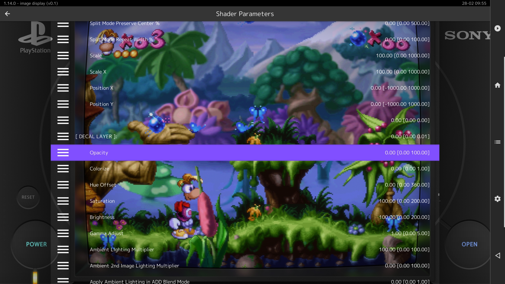

Here is our final result.

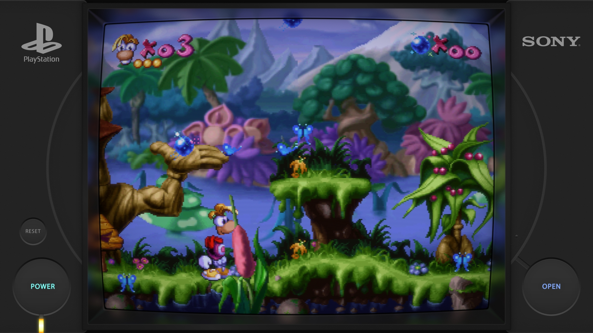

Save the preset as bezel.slangp by typing "bezel" in the save dialog.

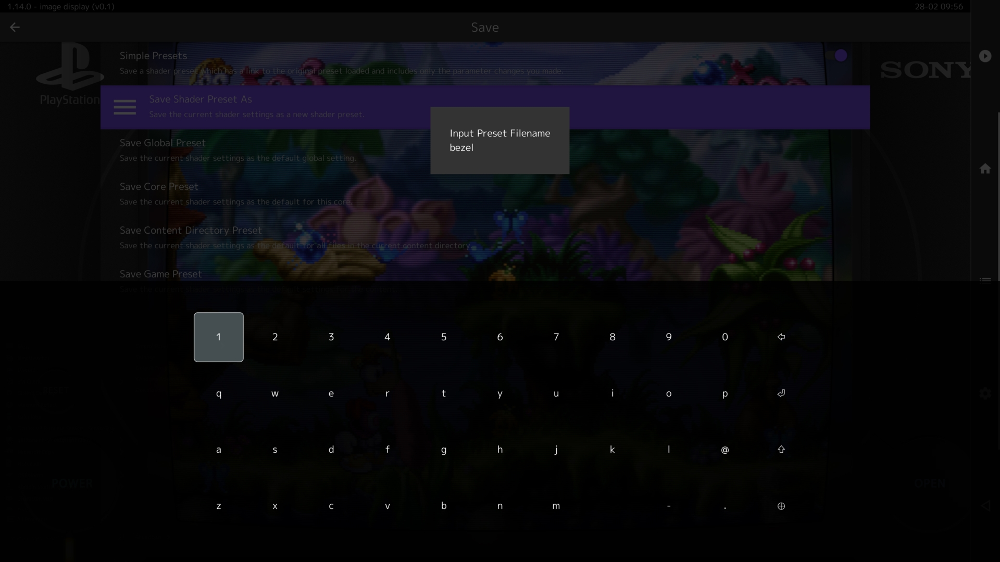

We will make use of the saved file later, first let's create a custom shader params.

Load the example preset again.

Press up in the shader parameters dialog to get to the end of the list and scroll up to the mask settings.

Change the CRT Mask to "7.00".

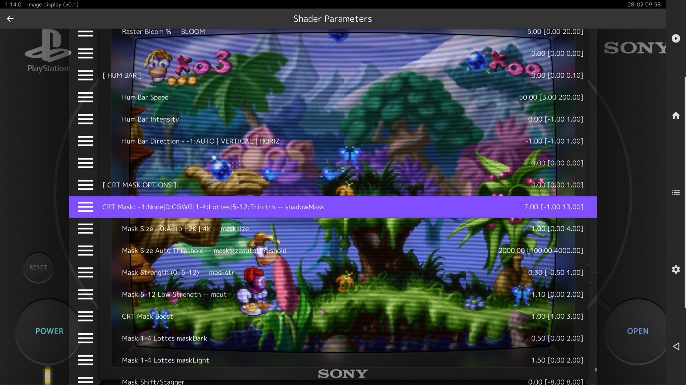

Change the Mask Size to "0.00" (Auto).

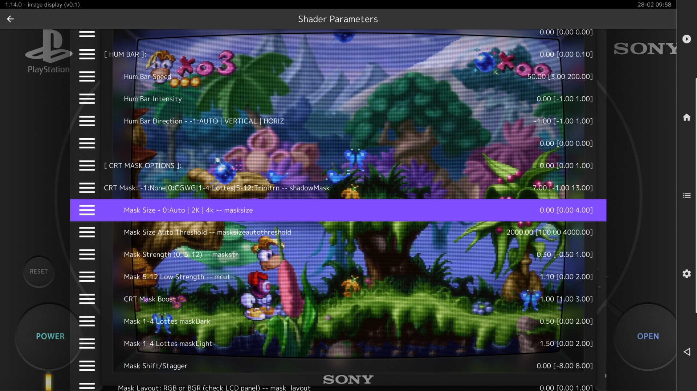

Scroll up to the Scanline Type section and change the value to "1.00".

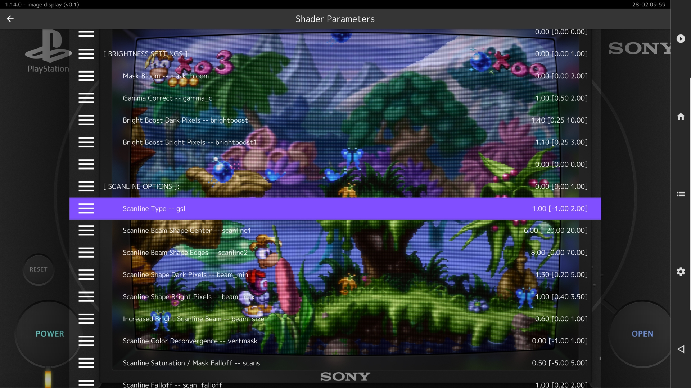

Scroll up again and turn on Magic Glow by changing the value to "1.00".

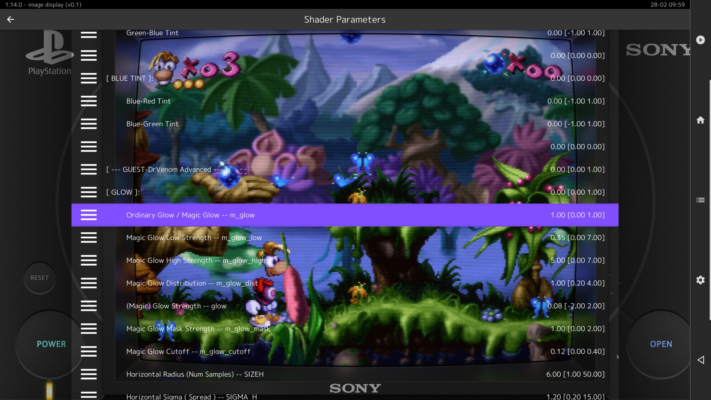

Change the Glow Strength to "0.30".

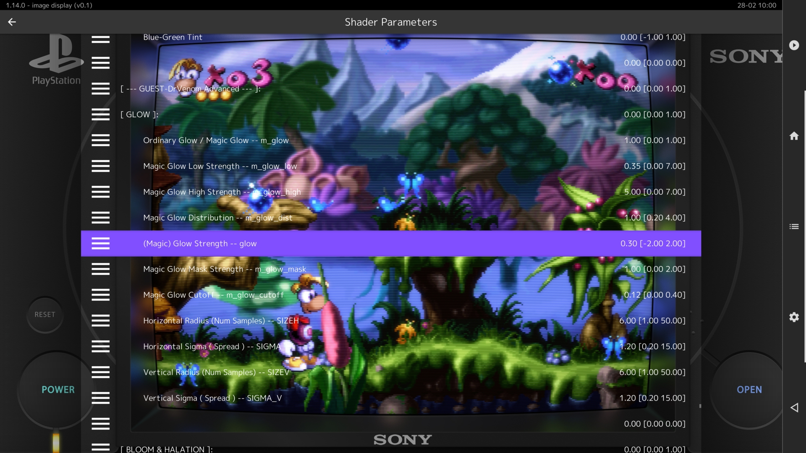

Finally, scroll down and increase the Slot Mask Strength Bright Pixels to "0.40".


Here is the final result.

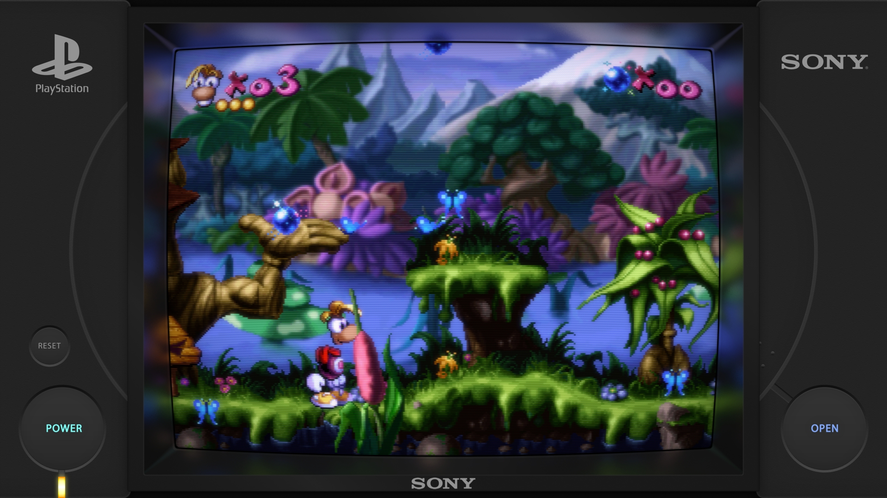

Save the preset as shader.slangp.

---

Now we'll convert our saved presets to params files.

First let's open the bezel.slangp in a text editor, it will be located in the root shaders folder.

#### \shaders\bezel.slangp

```cpp
#reference "Mega_Bezel_Packs/Duimon-Mega-Bezel/Presets/Standard/SONY_Playstation/Playstation_Alt-[STD]-[Guest]-[Bezel].slangp"
HSM_NON_INTEGER_SCALE = "88.769913"
HSM_BZL_WIDTH = "80.000000"
HSM_BZL_HEIGHT = "70.000000"
HSM_FRM_THICKNESS = "50.000000"
HSM_DECAL_OPACITY = "0.000000"
```

Remove the top line. (The reference line.)

```cpp
HSM_NON_INTEGER_SCALE = "88.769913"
HSM_BZL_WIDTH = "80.000000"
HSM_BZL_HEIGHT = "70.000000"
HSM_FRM_THICKNESS = "50.000000"
HSM_DECAL_OPACITY = "0.000000"
```
Save the file and rename it to "bezel.params".

Now perform the same actions on the shader.slangp file and save it as "shader.params".

---

OK... we have two "params" files, one that has only bezel and scaling parameters, and another with only shader parameters.

Next let's look at using them for local overrides. (Overrides for a single preset.)

For this we have a few choices, some more traditional than other. Let's look at the most traditional first.

The first step is to load content, a preset, and save a core, game, or content directory preset. (We'll use PSX content, the Beetle PSX HW core, the example preset, and save a core preset.)

After you have saved a preset, navigate to the config folder where it is saved and open the preset. 

#### \config\Beetle PSX HW\Beetle PSX HW.slangp

```cpp
#reference "Mega_Bezel_Packs/Duimon-Mega-Bezel/Presets/Standard/SONY_Playstation/Playstation_Alt-[STD]-[Guest]-[Bezel].slangp"
```

The most traditional method would be to paste the contents of one of our "params" files into this preset. (We'll start with the bezel.params.)

```cpp
#reference "Mega_Bezel_Packs/Duimon-Mega-Bezel/Presets/Standard/SONY_Playstation/Playstation_Alt-[STD]-[Guest]-[Bezel].slangp"
HSM_NON_INTEGER_SCALE = "88.769913"
HSM_BZL_WIDTH = "80.000000"
HSM_BZL_HEIGHT = "70.000000"
HSM_FRM_THICKNESS = "50.000000"
HSM_DECAL_OPACITY = "0.000000"
```

A more modern method is to add a second reference. For this we can copy the "bezel.params" file to the same folder as the preset and add a reference line.

```cpp
#reference "Mega_Bezel_Packs/Duimon-Mega-Bezel/Presets/Standard/SONY_Playstation/Playstation_Alt-[STD]-[Guest]-[Bezel].slangp"

#reference "bezel.params"
```

We can also add a third reference for the shader.params file. (After copying it to the same folder.)

```cpp
#reference "Mega_Bezel_Packs/Duimon-Mega-Bezel/Presets/Standard/SONY_Playstation/Playstation_Alt-[STD]-[Guest]-[Bezel].slangp"

#reference "bezel.params"

#reference "shader.params"
```

A third option involves editing my presets. There are various reasons to use this method, and as the shader and Retroarch development both progress, the reasons will become even more relevant.

The first step is to copy the "params" files to my local overrides folder.

#### \Duimon-Mega-Bezel\res\overrides

For the bezel.params...

#### \Duimon-Mega-Bezel\res\overrides_shader

...for the shader.params.

There is only one folder for local overrides. Going forward it would be best practice to name the shader.params file with the shader class it uses. (e.g. custom_bezel_01_STD.params or custom_bezel_01_ADV_SMOOTH.params if using that class as a base.) (The bezel.params can be a bit more simple. e.g. custom_bezel_01.params)

For this guide we will be keeping the existing names.

Now... open the example preset in a text editor.

#### \Duimon-Mega-Bezel\Presets\Standard\SONY_Playstation\Playstation_Alt-[STD]-[Guest]-[Bezel].slangp

```cpp
// DUIMON MEGA BEZEL GRAPHICS AND PRESETS | https://duimon.github.io/Gallery-Guides/ | duimonmb@gmail.com
// SOME RIGHTS RESERVED - RELEASED UNDER CC BY NC ND LICENSE https://creativecommons.org/licenses/by-nc-nd/4.0/deed
// ----------------------------------------------------------------------------------------------------------------

// PRESET START
// ----------------------------------------------------------------------------------------------------------------

// SHADER :: CONNECTOR | Interface to Mega Bezel Presets folders.
// Edit the target file in the following reference to globally define the base preset.
// ----------------------------------------------------------------------------------------------------------------

#reference "../../../zzz_global_params/Base_Shader/STD_Bezel.slangp"

// SHADER :: CONNECTOR :: LOCAL OVERRIDES | Interface to specific base presets.
// Comment out the top reference line and uncomment the following reference line to locally define the base preset.
// Keep in mind that some of the base presets use Integer Scale and may yield unexpected results. (e.g. Megatron)

//#reference "../../../zzz_global_params/Local_Shader/STD_02.slangp"

// "STD_02" matches the default "MBZ__3__STD__GDV.slangp".
// Replace the "02" with any from the following list.
// 01. STD__EASYMODE                    05. STD__MEGATRON-NTSC
// 02. STD__GDV                         06. STD-SUPER-XBR__GDV
// 03. STD__GDV-NTSC                    07. STD-SUPER-XBR__GDV-NTSC
// 04. STD__MEGATRON

// INTRO | Intro animation
// ----------------------------------------------------------------------------------------------------------------

// ON
#reference "../../../zzz_global_params/Intro/on.params"
// ON - No Image
//#reference "../../../zzz_global_params/Intro/on_no_image.params"
// ON - Default Mega Bezel intro
//#reference "../../../zzz_global_params/Intro/on_default.params"
// OFF
//#reference "../../../zzz_global_params/Intro/off.params"

// DEVICE | Screen/Monitor/CRT/TV settings
// ----------------------------------------------------------------------------------------------------------------

// DEVICE :: BASE
#reference "../../../res/bezel/bezel.params"

// DEVICE :: SCALING
#reference "../../../res/scale/bezel.params"

// DEVICE :: CRT

// IMAGE LAYERS
// ----------------------------------------------------------------------------------------------------------------
#reference "../../../res/layers/bezel.params"
#reference "../../../res/layers/SONY_Playstation/alt_bezel.params"

// HSV :: Hue, Saturation, and Value parameters
// ----------------------------------------------------------------------------------------------------------------

// GRAPHICS OVERRIDES | Overrides for Image layers, scaling, etc 
// that are not related to Guest's shader. (Three examples are provided)
// These are intended for [Bezel] versions and the following reference should be left commented out for others.
// ----------------------------------------------------------------------------------------------------------------

// GRAPHICS :: OVERRIDES
//#reference "../../../res/overrides/batocera.params"
//#reference "../../../res/overrides/batocera_nocurve.params"
//#reference "../../../res/overrides/batocera_hud.params"

// GLOBAL GRAPHICS :: OVERRIDES
// The user can edit the "user.params" to globally change the presets.
// These are for the bezel, frame, and other graphic attributes.
// Examples are included in the params file and commented out.
// These are also intended for [Bezel] versions and the following reference should be left commented out for others.
#reference "../../../zzz_global_params/Graphics/user.params"

// The following is restricted to the [Custom-Bezel_002] presets.
// One example is included in the params file and commented out.
//#reference "../../../zzz_global_params/Graphics/user2.params"

// SHADER OVERRIDES | Place *.params references to Guest derivatives here. 
// (Make sure you are using ADV__GDV, STD__GDV, or POTATO__GDV base presets for variations on the Guest shader.)
// Two examples were kindly provided by guest.r. ;-)
// ----------------------------------------------------------------------------------------------------------------

// SHADER :: OVERRIDES
//#reference "../../../res/overrides_shader/guest_custom_aperture.params"
//#reference "../../../res/overrides_shader/guest_custom_slotmask.params"

// GLOBAL SHADER :: OVERRIDES
// The user can edit the target params file to globally change the presets.
// To use community params that require another base preset, change the global base reference to match.
// Examples are included in the params file and commented out.
// Separate folders let users change global settings on each of the sets.
// These are intentionally commented out for LCD-GRID presets.
//#reference "../../../zzz_global_params/Shader/ADV/user_Bezel.params"
//#reference "../../../zzz_global_params/Shader/ADV_DREZ/user_Bezel.params"
#reference "../../../zzz_global_params/Shader/STD/user_Bezel.params"
//#reference "../../../zzz_global_params/Shader/STD_DREZ/user_Bezel.params"
//#reference "../../../zzz_global_params/Shader/LITE/user_Bezel.params"

// AMBIENT LIGHTING
//#reference "../../../res/lighting/night.params"

// PRESET END
// ----------------------------------------------------------------------------------------------------------------
```

For the bezel.params, the section we want to edit is the "// GRAPHICS :: OVERRIDES" section.

```cpp
// GRAPHICS :: OVERRIDES
//#reference "../../../res/overrides/batocera.params"
//#reference "../../../res/overrides/batocera_nocurve.params"
//#reference "../../../res/overrides/batocera_hud.params"
```

Follow the example syntax and add an uncommented reference for your custom params file.

```cpp
// GRAPHICS :: OVERRIDES
//#reference "../../../res/overrides/batocera.params"
//#reference "../../../res/overrides/batocera_nocurve.params"
//#reference "../../../res/overrides/batocera_hud.params"
#reference "../../../res/overrides/bezel.params"
```

Save the file and the next time you load it your params will be applied.

For the shader.params we want to edit the "// SHADER :: OVERRIDES" section.

```cpp
// SHADER :: OVERRIDES
//#reference "../../../res/overrides_shader/guest_custom_aperture.params"
//#reference "../../../res/overrides_shader/guest_custom_slotmask.params"
```

Add an uncommented reference to the shader.params file.

```cpp
// SHADER :: OVERRIDES
//#reference "../../../res/overrides_shader/guest_custom_aperture.params"
//#reference "../../../res/overrides_shader/guest_custom_slotmask.params"
#reference "../../../res/overrides_shader/shader.params".
```
Now these parameters will load the next time you use the preset.

---

The true power of my multiple reference presets lies in the global overrides. Unlike local overrides, there is only one method.

We will use an unmodified version of the example preset.

First, copy the "bezel.params" to my global Graphics override folder.

```cpp
\Duimon-Mega-Bezel\zzz_global_params\Graphics\params\
```
Then copy the shader params file to the STD global Shader folder.

```cpp
\Duimon-Mega-Bezel\zzz_global_params\Shader\STD\params\
```

Now open the example preset in your text editor again.

Let's take a look at the "// GLOBAL GRAPHICS :: OVERRIDES" section.

```cpp
// GLOBAL GRAPHICS :: OVERRIDES
// The user can edit the "user.params" to globally change the presets.
// These are for the bezel, frame, and other graphic attributes.
// Examples are included in the params file and commented out.
// These are also intended for [Bezel] versions and the following reference should be left commented out for others.
#reference "../../../zzz_global_params/Graphics/user.params"
```

You'll notice a single uncommented reference line at the end. I have limited the scope of graphics overrides the just the "Bezel" presets because altering the bezel parameters would break most other presets. (e.g. Finely tuned "Monitor" graphics or LCD systems.)

Follow the reference path and open the "user.params" file in a your text editor.

#### \Duimon-Mega-Bezel\zzz_global_params\Graphics\user.params

```cpp
// DUIMON MEGA BEZEL GRAPHICS AND PRESETS | https://duimon.github.io/Gallery-Guides/ | duimonmb@gmail.com
// SOME RIGHTS RESERVED - RELEASED UNDER CC BY NC ND LICENSE https://creativecommons.org/licenses/by-nc-nd/4.0/deed
// ----------------------------------------------------------------------------------------------------------------

// GLOBAL GRAPHGICS :: BEZEL
// Custom Parameters specific to the [Bezel] presets.
// ----------------------------------------------------------------------------------------------------------------


//#reference "/params/batocera.params"
//#reference "/params/batocera_nocurve.params"
//#reference "/params/batocera_hud.params"
```

Add an uncommented reference to your "bezel.params " file.

```cpp
// DUIMON MEGA BEZEL GRAPHICS AND PRESETS | https://duimon.github.io/Gallery-Guides/ | duimonmb@gmail.com
// SOME RIGHTS RESERVED - RELEASED UNDER CC BY NC ND LICENSE https://creativecommons.org/licenses/by-nc-nd/4.0/deed
// ----------------------------------------------------------------------------------------------------------------

// GLOBAL GRAPHGICS :: BEZEL
// Custom Parameters specific to the [Bezel] presets.
// ----------------------------------------------------------------------------------------------------------------


//#reference "/params/batocera.params"
//#reference "/params/batocera_nocurve.params"
//#reference "/params/batocera_hud.params"
#reference "/params/bezel.params"
```

Save the file and every one of your "[Bezel]" and "[Bezel]-[Night]" parameters will now share the new settings.

---

Now let's move on to the shader.params file.

Open the example preset in your text editor again.

Let's take a look at the "// GLOBAL SHADER :: OVERRIDES" section.

```cpp
// GLOBAL SHADER :: OVERRIDES
// The user can edit the target params file to globally change the presets.
// To use community params that require another base preset, change the global base reference to match.
// Examples are included in the params file and commented out.
// Separate folders let users change global settings on each of the sets.
// These are intentionally commented out for LCD-GRID presets.
//#reference "../../../zzz_global_params/Shader/ADV/user_Bezel.params"
//#reference "../../../zzz_global_params/Shader/ADV_DREZ/user_Bezel.params"
#reference "../../../zzz_global_params/Shader/STD/user_Bezel.params"
//#reference "../../../zzz_global_params/Shader/STD_DREZ/user_Bezel.params"
//#reference "../../../zzz_global_params/Shader/LITE/user_Bezel.params"
```

You notice that there is a seperate reference for each preset class, with an uncommented reference for the "STD" class.

Within each class folder (ADV, ADV_DREZ,STD, etc.) you will find a user params for each subclass.

i.e.
```cpp
user.params
user_Bezel.params
user_Bezel1.params
user_Bezel2.params
user_PVM20.params
user_TM20.params
```

Follow the reference path and open the STD "user_Bezel.params".

#### \Duimon-Mega-Bezel\zzz_global_params\Shader\STD\user_Bezel.params

```cpp
// DUIMON MEGA BEZEL GRAPHICS AND PRESETS | https://duimon.github.io/Gallery-Guides/ | duimonmb@gmail.com
// SOME RIGHTS RESERVED - RELEASED UNDER CC BY NC ND LICENSE https://creativecommons.org/licenses/by-nc-nd/4.0/deed
// ----------------------------------------------------------------------------------------------------------------

// CRT SHADER PARAMETERS :: STD
// Parameters specific to the CRT shader.
// These are not intended for Mega Bezel community presets, but for Guest etc. standalone derivitives.
// Mega Bezel community presets will require an external refernce.
// ----------------------------------------------------------------------------------------------------------------


//#reference "/params/guest_custom_aperture.params"
//#reference "/params/guest_custom_slotmask.params"
```

Add an uncommented reference to your custom shader.params.

```cpp
// DUIMON MEGA BEZEL GRAPHICS AND PRESETS | https://duimon.github.io/Gallery-Guides/ | duimonmb@gmail.com
// SOME RIGHTS RESERVED - RELEASED UNDER CC BY NC ND LICENSE https://creativecommons.org/licenses/by-nc-nd/4.0/deed
// ----------------------------------------------------------------------------------------------------------------

// CRT SHADER PARAMETERS :: STD
// Parameters specific to the CRT shader.
// These are not intended for Mega Bezel community presets, but for Guest etc. standalone derivitives.
// Mega Bezel community presets will require an external refernce.
// ----------------------------------------------------------------------------------------------------------------


//#reference "/params/guest_custom_aperture.params"
//#reference "/params/guest_custom_slotmask.params"
#reference "/params/shader.params"
```

Save the file and every one of your "[Bezel]" and "[Bezel]-[Night]" parameters will now share the new settings.

---

My introduction guide (And comments in the presets.) detail how to globally or locally change the base preset class to use parameters from other base presets as params reference files.

---

To sum up...

The global shader overrides are set up so that you can share shader parameters with the entire subclass. (You can have specific settings for the PVM20, TM20, Bezel, etc.)

The global graphics overrides effect only the [Bezel] subclass. (And the [Custom-Bezel_002] if you examine the presets closely. ;-))

Local overrides can be performed using various methods and you can choose the method that fits your needs and/or workflow.

I have concentrated on separate parameters for shader and graphics in this guide but it is possible to use combined parameters taken from Mega Bezel community presets that change the scale and/or curvature. For this particular type of params file I strongly suggest you use the Global Graphics overrides if you intend to use global settings. (This will limit the scope to only "Bezel" presets and not effect those that need to maintain specific scale parameters etc.)

The next guide in the series will detail creating a params file from stand-alone shaders and community Mega Bezel presets.
