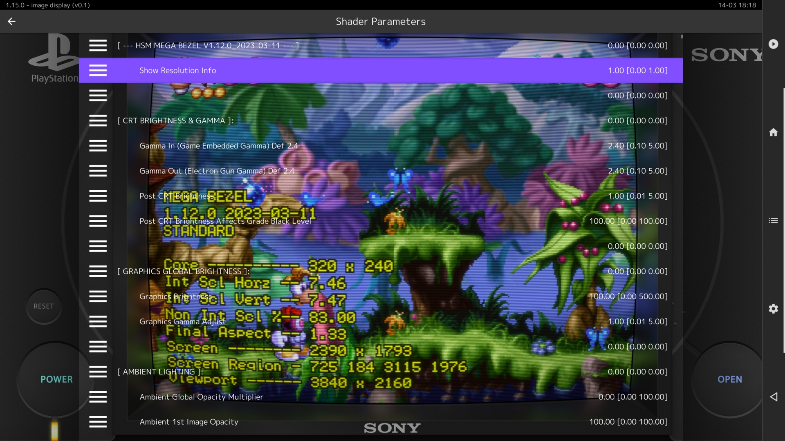
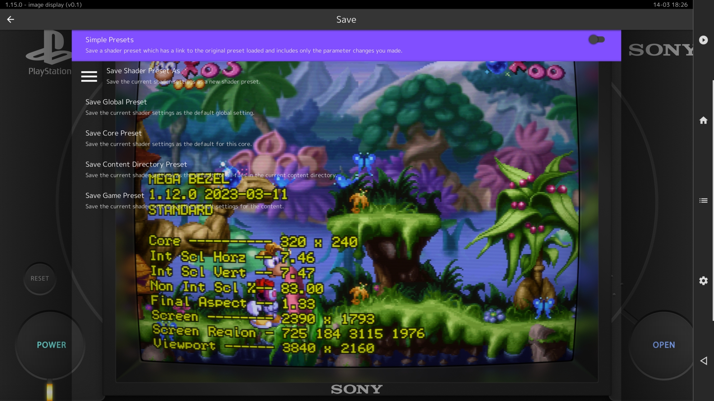

### Community Derived Params Files.

---

In the first guide of this series I walked you through creating your own params files for use in my presets.

In this guide we will look at getting params from community presets, both standalone and Mega Bezel.

---

To start off we will flatten one of my multiple reference/boilerplate presets.

First lets take a look at the top section of the example preset in the last guide.

#### \Duimon-Mega-Bezel\Presets\Standard\SONY_Playstation\Playstation_Alt-[STD]-[Guest]-[Bezel].slangp

```cpp
// DUIMON MEGA BEZEL GRAPHICS AND PRESETS | https://duimon.github.io/Gallery-Guides/ | duimonmb@gmail.com
// SOME RIGHTS RESERVED - RELEASED UNDER CC BY NC ND LICENSE https://creativecommons.org/licenses/by-nc-nd/4.0/deed
// ----------------------------------------------------------------------------------------------------------------

// PRESET START
// ----------------------------------------------------------------------------------------------------------------

// SHADER :: CONNECTOR | Interface to Mega Bezel Presets folders.
// Edit the target file in the following reference to globally define the base preset.
// ----------------------------------------------------------------------------------------------------------------

#reference "../../../zzz_global_params/Base_Shader/STD_Bezel.slangp"
```

Whether you are working with one of my presets, or another community preset, determining the base preset is the most important (And probably hardest.) thing you need to do.

Let's follow the reference path and open the target file.

#### \Duimon-Mega-Bezel\zzz_global_params\Base_Shader\STD_Bezel.slangp

```cpp
// DUIMON MEGA BEZEL GRAPHICS AND PRESETS | https://duimon.github.io/Gallery-Guides/ | duimonmb@gmail.com
// SOME RIGHTS RESERVED - RELEASED UNDER CC BY NC ND LICENSE https://creativecommons.org/licenses/by-nc-nd/4.0/deed
// ----------------------------------------------------------------------------------------------------------------

// BASE SHADER REFERENCES
// INSURE THAT THE BASE SHADER MATCHES THAT OF ANY GLOBAL PARAMS YOU USE
// ----------------------------------------------------------------------------------------------------------------


// STANDARD :: For regular setup.
// ----------------------------------------------------------------------------------------------------------------

//#reference "../../../../shaders_slang/bezel/Mega_Bezel/Presets/Base_CRT_Presets/MBZ__3__STD__EASYMODE.slangp"
#reference "../../../../shaders_slang/bezel/Mega_Bezel/Presets/Base_CRT_Presets/MBZ__3__STD__GDV.slangp"
//#reference "../../../../shaders_slang/bezel/Mega_Bezel/Presets/Base_CRT_Presets/MBZ__3__STD__GDV-NTSC.slangp"
//#reference "../../../../shaders_slang/bezel/Mega_Bezel/Presets/Base_CRT_Presets/MBZ__3__STD__MEGATRON.slangp"
//#reference "../../../../shaders_slang/bezel/Mega_Bezel/Presets/Base_CRT_Presets/MBZ__3__STD__MEGATRON-NTSC.slangp"
//#reference "../../../../shaders_slang/bezel/Mega_Bezel/Presets/Base_CRT_Presets/MBZ__3__STD-SUPER-XBR__GDV.slangp"
//#reference "../../../../shaders_slang/bezel/Mega_Bezel/Presets/Base_CRT_Presets/MBZ__3__STD-SUPER-XBR__GDV-NTSC.slangp"

```

This is an abbreviated sample that shows the only uncommented reference line.

```cpp
#reference "../../../../shaders_slang/bezel/Mega_Bezel/Presets/Base_CRT_Presets/MBZ__3__STD__GDV.slangp"
```

Make note of this base preset for use later. For other community presets the process is the same, but you may need to follow more that one consecutive reference before finding the base preset.

---

Second, load some content with any core. I will use the image viewer core, a Playstation screenshot, and the example preset.

Once the preset is loaded open the parameters dialog and enable the first parameter. (Show Resolution Info.)



We are going to be saving a full preset, but even so, the system will save a simple reference preset unless we make some change. The first parameter is a good choice as we will see later.

Next, go to the save preset dialog and disable simple presets.



Save the preset as sample.slangp.

Turn on simple presets again and quit retroarch gracefully from the menu.

Now open the saved preset in a text editor.

#### \shaders\sample.slangp

There will be many lines of text. Locate the line...

```cpp
HSM_RESOLUTION_DEBUG_ON = "1.000000"
```

...and delete it and all the lines above it. (Changing the first parameter in the list makes this easy work.)

Now let's take a look at the remaining lines in the preset.

```cpp
HSM_ASPECT_RATIO_ORIENTATION = "1.000000"
HSM_ASPECT_RATIO_MODE = "2.000000"
HSM_BZL_NOISE = "10.000000"
HSM_FRM_NOISE = "10.000000"
HSM_FRM_OUTER_EDGE_SHADING = "40.000000"
HSM_FRM_SHADOW_WIDTH = "50.000000"
HSM_BG_FILL_MODE = "1.000000"
HSM_LED_OPACITY = "0.000000"
HSM_LED_FILL_MODE = "1.000000"
HSM_DECAL_FOLLOW_LAYER = "2.000000"
textures = "SamplerLUT1;SamplerLUT2;SamplerLUT3;SamplerLUT4;IntroImage;ScreenPlacementImage;TubeDiffuseImage;TubeColoredGelImage;TubeShadowImage;TubeStaticReflectionImage;BackgroundImage;BackgroundVertImage;ReflectionMaskImage;FrameTextureImage;CabinetGlassImage;DeviceImage;DeviceVertImage;DeviceLEDImage;DecalImage;NightLightingImage;NightLighting2Image;LEDImage;TopLayerImage"
SamplerLUT1 = "shaders_slang/bezel/Mega_Bezel/shaders/guest/lut/trinitron-lut.png"
SamplerLUT1_linear = "true"
SamplerLUT1_wrap_mode = "clamp_to_border"
SamplerLUT1_mipmap = "false"
SamplerLUT2 = "shaders_slang/bezel/Mega_Bezel/shaders/guest/lut/inv-trinitron-lut.png"
SamplerLUT2_linear = "true"
SamplerLUT2_wrap_mode = "clamp_to_border"
SamplerLUT2_mipmap = "false"
SamplerLUT3 = "shaders_slang/bezel/Mega_Bezel/shaders/guest/lut/nec-lut.png"
SamplerLUT3_linear = "true"
SamplerLUT3_wrap_mode = "clamp_to_border"
SamplerLUT3_mipmap = "false"
SamplerLUT4 = "shaders_slang/bezel/Mega_Bezel/shaders/guest/lut/ntsc-lut.png"
SamplerLUT4_linear = "true"
SamplerLUT4_wrap_mode = "clamp_to_border"
SamplerLUT4_mipmap = "false"
IntroImage = "Mega_Bezel_Community/Duimon-Mega-Bezel/Graphics/_Common/Duimon_OSD.png"
IntroImage_linear = "true"
IntroImage_wrap_mode = "clamp_to_border"
IntroImage_mipmap = "true"
ScreenPlacementImage = "shaders_slang/bezel/Mega_Bezel/shaders/textures/Placeholder_Transparent_16x16.png"
ScreenPlacementImage_linear = "false"
ScreenPlacementImage_wrap_mode = "clamp_to_border"
ScreenPlacementImage_mipmap = "false"
TubeDiffuseImage = "shaders_slang/bezel/Mega_Bezel/shaders/textures/Tube_Diffuse_2390x1792.png"
TubeDiffuseImage_linear = "true"
TubeDiffuseImage_wrap_mode = "clamp_to_border"
TubeDiffuseImage_mipmap = "true"
TubeColoredGelImage = "shaders_slang/bezel/Mega_Bezel/shaders/textures/Colored_Gel_Rainbow.png"
TubeColoredGelImage_linear = "true"
TubeColoredGelImage_wrap_mode = "clamp_to_border"
TubeColoredGelImage_mipmap = "true"
TubeShadowImage = "shaders_slang/bezel/Mega_Bezel/shaders/textures/Tube_Shadow_1600x1200.png"
TubeShadowImage_linear = "true"
TubeShadowImage_wrap_mode = "clamp_to_border"
TubeShadowImage_mipmap = "true"
TubeStaticReflectionImage = "shaders_slang/bezel/Mega_Bezel/shaders/textures/TubeGlassOverlayImageCropped_1440x1080.png"
TubeStaticReflectionImage_linear = "true"
TubeStaticReflectionImage_wrap_mode = "clamp_to_border"
TubeStaticReflectionImage_mipmap = "true"
BackgroundImage = "Mega_Bezel_Community/Duimon-Mega-Bezel/Graphics/SONY_Playstation/Playstation_Alt.png"
BackgroundImage_linear = "true"
BackgroundImage_wrap_mode = "clamp_to_border"
BackgroundImage_mipmap = "true"
BackgroundVertImage = "shaders_slang/bezel/Mega_Bezel/shaders/textures/Placeholder_Transparent_16x16.png"
BackgroundVertImage_linear = "true"
BackgroundVertImage_wrap_mode = "clamp_to_border"
BackgroundVertImage_mipmap = "true"
ReflectionMaskImage = "shaders_slang/bezel/Mega_Bezel/shaders/textures/Placeholder_White_16x16.png"
ReflectionMaskImage_linear = "true"
ReflectionMaskImage_wrap_mode = "clamp_to_border"
ReflectionMaskImage_mipmap = "true"
FrameTextureImage = "shaders_slang/bezel/Mega_Bezel/shaders/textures/FrameTexture_2800x2120.png"
FrameTextureImage_linear = "true"
FrameTextureImage_wrap_mode = "clamp_to_border"
FrameTextureImage_mipmap = "true"
CabinetGlassImage = "shaders_slang/bezel/Mega_Bezel/shaders/textures/Placeholder_Transparent_16x16.png"
CabinetGlassImage_linear = "true"
CabinetGlassImage_wrap_mode = "clamp_to_border"
CabinetGlassImage_mipmap = "true"
DeviceImage = "shaders_slang/bezel/Mega_Bezel/shaders/textures/Placeholder_Transparent_16x16.png"
DeviceImage_linear = "true"
DeviceImage_wrap_mode = "clamp_to_border"
DeviceImage_mipmap = "true"
DeviceVertImage = "shaders_slang/bezel/Mega_Bezel/shaders/textures/Placeholder_Transparent_16x16.png"
DeviceVertImage_linear = "true"
DeviceVertImage_wrap_mode = "clamp_to_border"
DeviceVertImage_mipmap = "true"
DeviceLEDImage = "shaders_slang/bezel/Mega_Bezel/shaders/textures/Placeholder_Transparent_16x16.png"
DeviceLEDImage_linear = "true"
DeviceLEDImage_wrap_mode = "clamp_to_border"
DeviceLEDImage_mipmap = "true"
DecalImage = "Mega_Bezel_Community/Duimon-Mega-Bezel/Graphics/SONY_Playstation/Playstation_Alt_Decal.png"
DecalImage_linear = "true"
DecalImage_wrap_mode = "clamp_to_border"
DecalImage_mipmap = "true"
NightLightingImage = "shaders_slang/bezel/Mega_Bezel/shaders/textures/NightLightingClose_1920x1080.png"
NightLightingImage_linear = "true"
NightLightingImage_wrap_mode = "clamp_to_border"
NightLightingImage_mipmap = "true"
NightLighting2Image = "shaders_slang/bezel/Mega_Bezel/shaders/textures/NightLightingFar_1920x1080.png"
NightLighting2Image_linear = "true"
NightLighting2Image_wrap_mode = "clamp_to_border"
NightLighting2Image_mipmap = "true"
LEDImage = "Mega_Bezel_Community/Duimon-Mega-Bezel/Graphics/SONY_Playstation/Playstation_Alt_LED.png"
LEDImage_linear = "true"
LEDImage_wrap_mode = "clamp_to_border"
LEDImage_mipmap = "true"
TopLayerImage = "shaders_slang/bezel/Mega_Bezel/shaders/textures/Placeholder_Transparent_16x16.png"
TopLayerImage_linear = "true"
TopLayerImage_wrap_mode = "clamp_to_border"
TopLayerImage_mipmap = "true"

```

Scroll to the end and look for an image path that contains "Duimon-Mega-Bezel".

e.g.

```cpp
LEDImage = "Mega_Bezel_Community/Duimon-Mega-Bezel/Graphics/SONY_Playstation/Playstation_Alt_LED.png"
```

Then scroll up and look for the line that starts with 
```cpp
textures = "
```

Starting with the textures line, remove it and every line below it that does not contain "Duimon-Mega-Bezel".

We are left with this.

```cpp
HSM_ASPECT_RATIO_ORIENTATION = "1.000000"
HSM_ASPECT_RATIO_MODE = "2.000000"
HSM_BZL_NOISE = "10.000000"
HSM_FRM_NOISE = "10.000000"
HSM_FRM_OUTER_EDGE_SHADING = "40.000000"
HSM_FRM_SHADOW_WIDTH = "50.000000"
HSM_BG_FILL_MODE = "1.000000"
HSM_LED_OPACITY = "0.000000"
HSM_LED_FILL_MODE = "1.000000"
HSM_DECAL_FOLLOW_LAYER = "2.000000"
IntroImage = "Mega_Bezel_Community/Duimon-Mega-Bezel/Graphics/_Common/Duimon_OSD.png"
BackgroundImage = "Mega_Bezel_Community/Duimon-Mega-Bezel/Graphics/SONY_Playstation/Playstation_Alt.png"
DecalImage = "Mega_Bezel_Community/Duimon-Mega-Bezel/Graphics/SONY_Playstation/Playstation_Alt_Decal.png"

```

As long as it is located in the root shaders folder, this could now be used as a params file. To make it a standalone slangp preset we need to add the reference line from the first exersise in the guide.

```cpp
#reference "../../../../shaders_slang/bezel/Mega_Bezel/Presets/Base_CRT_Presets/MBZ__3__STD__GDV.slangp"
```

We end up with this.

```cpp
#reference "../../../../shaders_slang/bezel/Mega_Bezel/Presets/Base_CRT_Presets/MBZ__3__STD__GDV.slangp"
HSM_ASPECT_RATIO_ORIENTATION = "1.000000"
HSM_ASPECT_RATIO_MODE = "2.000000"
HSM_BZL_NOISE = "10.000000"
HSM_FRM_NOISE = "10.000000"
HSM_FRM_OUTER_EDGE_SHADING = "40.000000"
HSM_FRM_SHADOW_WIDTH = "50.000000"
HSM_BG_FILL_MODE = "1.000000"
HSM_LED_OPACITY = "0.000000"
HSM_LED_FILL_MODE = "1.000000"
HSM_DECAL_FOLLOW_LAYER = "2.000000"
IntroImage = "Mega_Bezel_Community/Duimon-Mega-Bezel/Graphics/_Common/Duimon_OSD.png"
BackgroundImage = "Mega_Bezel_Community/Duimon-Mega-Bezel/Graphics/SONY_Playstation/Playstation_Alt.png"
DecalImage = "Mega_Bezel_Community/Duimon-Mega-Bezel/Graphics/SONY_Playstation/Playstation_Alt_Decal.png"

```

Almost done. We need to strip the leading ```../../../``` from the reference path so it reads.

```cpp
#reference "shaders_slang/bezel/Mega_Bezel/Presets/Base_CRT_Presets/MBZ__3__STD__GDV.slangp"
```

Finished. If you move the preset from the root shaders folder you will need to edit the reference and image paths, using either direct paths or relative. Relative vs. Direct paths are outside the scope of this guide. (You can google it. ;-))

You can use the same method for creating params files from other community presets, for use in my presets. The only difference is you need to change the reference of the parent preset to reflect the base preset you are deriving your params from. My introduction guide details making changes to the base preset.

As I said in the last guide, I recommend using a "Bezel" graphics override in my presets, as opposed to a shader override, so the change is limited to only "Bezel" presets.

You could also use the flattened version of my preset, without the reference line, as a reference in a community preset. (Multiple reference presets can only have one reference that points to a complete shader chain.)

You would also have to be careful that none of my scaling or curvature settings conflict with the community preset.

---

Now let's move on to getting a params from a standalone preset.

For the example I will use a preset that @ProfessorBraun recently posted in the Guest Advanced thread.

```cpp
shaders = "12"
shader0 = "shaders_slang/crt/shaders/guest/advanced/stock.slang"
filter_linear0 = "false"
wrap_mode0 = "clamp_to_border"
mipmap_input0 = "false"
alias0 = ""
float_framebuffer0 = "false"
srgb_framebuffer0 = "false"
scale_type_x0 = "source"
scale_x0 = "1.000000"
scale_type_y0 = "source"
scale_y0 = "1.000000"
shader1 = "shaders_slang/crt/shaders/guest/advanced/stock.slang"
filter_linear1 = "false"
wrap_mode1 = "clamp_to_border"
mipmap_input1 = "false"
alias1 = "StockPass"
float_framebuffer1 = "false"
srgb_framebuffer1 = "false"
scale_type_x1 = "source"
scale_x1 = "1.000000"
scale_type_y1 = "source"
scale_y1 = "1.000000"
shader2 = "shaders_slang/crt/shaders/guest/advanced/afterglow0.slang"
filter_linear2 = "false"
wrap_mode2 = "clamp_to_border"
mipmap_input2 = "false"
alias2 = "AfterglowPass"
float_framebuffer2 = "false"
srgb_framebuffer2 = "false"
scale_type_x2 = "source"
scale_x2 = "1.000000"
scale_type_y2 = "source"
scale_y2 = "1.000000"
shader3 = "shaders_slang/crt/shaders/guest/advanced/pre-shaders-afterglow.slang"
filter_linear3 = "false"
wrap_mode3 = "clamp_to_border"
mipmap_input3 = "true"
alias3 = "PrePass"
float_framebuffer3 = "false"
srgb_framebuffer3 = "false"
scale_type_x3 = "source"
scale_x3 = "1.000000"
scale_type_y3 = "source"
scale_y3 = "1.000000"
shader4 = "shaders_slang/crt/shaders/guest/advanced/avg-lum.slang"
filter_linear4 = "true"
wrap_mode4 = "clamp_to_border"
mipmap_input4 = "true"
alias4 = "AvgLumPass"
float_framebuffer4 = "false"
srgb_framebuffer4 = "false"
scale_type_x4 = "source"
scale_x4 = "1.000000"
scale_type_y4 = "source"
scale_y4 = "1.000000"
shader5 = "shaders_slang/crt/shaders/guest/advanced/linearize.slang"
filter_linear5 = "true"
wrap_mode5 = "clamp_to_border"
mipmap_input5 = "false"
alias5 = "LinearizePass"
float_framebuffer5 = "true"
srgb_framebuffer5 = "false"
scale_type_x5 = "source"
scale_x5 = "1.000000"
scale_type_y5 = "source"
scale_y5 = "1.000000"
shader6 = "shaders_slang/crt/shaders/guest/advanced/gaussian_horizontal.slang"
filter_linear6 = "true"
wrap_mode6 = "clamp_to_border"
mipmap_input6 = "false"
alias6 = ""
float_framebuffer6 = "true"
srgb_framebuffer6 = "false"
scale_type_x6 = "source"
scale_x6 = "1.000000"
scale_type_y6 = "source"
scale_y6 = "1.000000"
shader7 = "shaders_slang/crt/shaders/guest/advanced/gaussian_vertical.slang"
filter_linear7 = "true"
wrap_mode7 = "clamp_to_border"
mipmap_input7 = "false"
alias7 = "GlowPass"
float_framebuffer7 = "true"
srgb_framebuffer7 = "false"
scale_type_x7 = "source"
scale_x7 = "1.000000"
scale_type_y7 = "source"
scale_y7 = "1.000000"
shader8 = "shaders_slang/crt/shaders/guest/advanced/bloom_horizontal.slang"
filter_linear8 = "true"
wrap_mode8 = "clamp_to_border"
mipmap_input8 = "false"
alias8 = ""
float_framebuffer8 = "true"
srgb_framebuffer8 = "false"
scale_type_x8 = "source"
scale_x8 = "1.000000"
scale_type_y8 = "source"
scale_y8 = "1.000000"
shader9 = "shaders_slang/crt/shaders/guest/advanced/bloom_vertical.slang"
filter_linear9 = "true"
wrap_mode9 = "clamp_to_border"
mipmap_input9 = "false"
alias9 = "BloomPass"
float_framebuffer9 = "true"
srgb_framebuffer9 = "false"
scale_type_x9 = "source"
scale_x9 = "1.000000"
scale_type_y9 = "source"
scale_y9 = "1.000000"
shader10 = "shaders_slang/crt/shaders/guest/advanced/crt-guest-advanced.slang"
filter_linear10 = "true"
wrap_mode10 = "clamp_to_border"
mipmap_input10 = "false"
alias10 = ""
float_framebuffer10 = "true"
srgb_framebuffer10 = "false"
scale_type_x10 = "viewport"
scale_x10 = "1.000000"
scale_type_y10 = "viewport"
scale_y10 = "1.000000"
shader11 = "shaders_slang/crt/shaders/guest/advanced/deconvergence.slang"
filter_linear11 = "true"
wrap_mode11 = "clamp_to_border"
mipmap_input11 = "false"
alias11 = ""
float_framebuffer11 = "false"
srgb_framebuffer11 = "false"
scale_type_x11 = "viewport"
scale_x11 = "1.000000"
scale_type_y11 = "viewport"
scale_y11 = "1.000000"
AS = "0.000000"
GAMMA_INPUT = "2.000000"
gamma_out = "2.200000"
interm = "0.000000"
intres = "0.500000"
m_glow = "1.000000"
m_glow_cutoff = "0.000000"
m_glow_low = "0.500000"
m_glow_high = "0.000000"
m_glow_mask = "0.000000"
SIZEHB = "0.000000"
SIGMA_HB = "0.050000"
SIZEVB = "1.000000"
SIGMA_VB = "0.050000"
glow = "0.040000"
bloom = "0.030000"
brightboost = "1.000000"
brightboost1 = "1.000000"
gsl = "2.000000"
scanline1 = "20.000000"
scanline2 = "20.000000"
beam_min = "1.150000"
beam_max = "1.100000"
beam_size = "0.000000"
scan_falloff = "0.200000"
spike = "0.000000"
scangamma = "5.000000"
h_sharp = "15.000000"
s_sharp = "8.700000"
ei_limit = "0.000000"
sth = "0.000000"
c_shape = "0.050000"
bsize1 = "0.000000"
sborder = "0.250000"
shadowMask = "10.000000"
maskstr = "1.000000"
mcut = "2.000000"
maskDark = "0.000000"
maskLight = "1.000000"
mshift = "-2.000000"
mask_gamma = "10.000000"
post_br = "1.370000"
textures = "SamplerLUT1;SamplerLUT2;SamplerLUT3;SamplerLUT4"
SamplerLUT1 = "shaders_slang/crt/shaders/guest/advanced/lut/trinitron-lut.png"
SamplerLUT1_linear = "true"
SamplerLUT1_wrap_mode = "clamp_to_border"
SamplerLUT1_mipmap = "false"
SamplerLUT2 = "shaders_slang/crt/shaders/guest/advanced/lut/inv-trinitron-lut.png"
SamplerLUT2_linear = "true"
SamplerLUT2_wrap_mode = "clamp_to_border"
SamplerLUT2_mipmap = "false"
SamplerLUT3 = "shaders_slang/crt/shaders/guest/advanced/lut/nec-lut.png"
SamplerLUT3_linear = "true"
SamplerLUT3_wrap_mode = "clamp_to_border"
SamplerLUT3_mipmap = "false"
SamplerLUT4 = "shaders_slang/crt/shaders/guest/advanced/lut/ntsc-lut.png"
SamplerLUT4_linear = "true"
SamplerLUT4_wrap_mode = "clamp_to_border"
SamplerLUT4_mipmap = "false"
```


This preset has 12 passes.

```cpp
shaders = "12"
```

You'll notice the the passes are numbered...

e.g.

```cpp
shader0 =
shader1 =
shader2 =
```

... each pass has similar settings just before the next pass.

e.g.

```cpp
scale_y1 = "1.000000"
```

12 - 1 = 11 so look for 

```cpp
shader11 = "
```

and find the last settings parameter.

```cpp
scale_y11 = "1.000000"
```

Delete it and every line above it. We are left with this.

```cpp
AS = "0.000000"
GAMMA_INPUT = "2.000000"
gamma_out = "2.200000"
interm = "0.000000"
intres = "0.500000"
m_glow = "1.000000"
m_glow_cutoff = "0.000000"
m_glow_low = "0.500000"
m_glow_high = "0.000000"
m_glow_mask = "0.000000"
SIZEHB = "0.000000"
SIGMA_HB = "0.050000"
SIZEVB = "1.000000"
SIGMA_VB = "0.050000"
glow = "0.040000"
bloom = "0.030000"
brightboost = "1.000000"
brightboost1 = "1.000000"
gsl = "2.000000"
scanline1 = "20.000000"
scanline2 = "20.000000"
beam_min = "1.150000"
beam_max = "1.100000"
beam_size = "0.000000"
scan_falloff = "0.200000"
spike = "0.000000"
scangamma = "5.000000"
h_sharp = "15.000000"
s_sharp = "8.700000"
ei_limit = "0.000000"
sth = "0.000000"
c_shape = "0.050000"
bsize1 = "0.000000"
sborder = "0.250000"
shadowMask = "10.000000"
maskstr = "1.000000"
mcut = "2.000000"
maskDark = "0.000000"
maskLight = "1.000000"
mshift = "-2.000000"
mask_gamma = "10.000000"
post_br = "1.370000"
textures = "SamplerLUT1;SamplerLUT2;SamplerLUT3;SamplerLUT4"
SamplerLUT1 = "shaders_slang/crt/shaders/guest/advanced/lut/trinitron-lut.png"
SamplerLUT1_linear = "true"
SamplerLUT1_wrap_mode = "clamp_to_border"
SamplerLUT1_mipmap = "false"
SamplerLUT2 = "shaders_slang/crt/shaders/guest/advanced/lut/inv-trinitron-lut.png"
SamplerLUT2_linear = "true"
SamplerLUT2_wrap_mode = "clamp_to_border"
SamplerLUT2_mipmap = "false"
SamplerLUT3 = "shaders_slang/crt/shaders/guest/advanced/lut/nec-lut.png"
SamplerLUT3_linear = "true"
SamplerLUT3_wrap_mode = "clamp_to_border"
SamplerLUT3_mipmap = "false"
SamplerLUT4 = "shaders_slang/crt/shaders/guest/advanced/lut/ntsc-lut.png"
SamplerLUT4_linear = "true"
SamplerLUT4_wrap_mode = "clamp_to_border"
SamplerLUT4_mipmap = "false"
```

Now look for the 
```cpp
textures = "
```
line, as we did with my preset.

Delete it and every line below it.

We are left with this.

```cpp
AS = "0.000000"
GAMMA_INPUT = "2.000000"
gamma_out = "2.200000"
interm = "0.000000"
intres = "0.500000"
m_glow = "1.000000"
m_glow_cutoff = "0.000000"
m_glow_low = "0.500000"
m_glow_high = "0.000000"
m_glow_mask = "0.000000"
SIZEHB = "0.000000"
SIGMA_HB = "0.050000"
SIZEVB = "1.000000"
SIGMA_VB = "0.050000"
glow = "0.040000"
bloom = "0.030000"
brightboost = "1.000000"
brightboost1 = "1.000000"
gsl = "2.000000"
scanline1 = "20.000000"
scanline2 = "20.000000"
beam_min = "1.150000"
beam_max = "1.100000"
beam_size = "0.000000"
scan_falloff = "0.200000"
spike = "0.000000"
scangamma = "5.000000"
h_sharp = "15.000000"
s_sharp = "8.700000"
ei_limit = "0.000000"
sth = "0.000000"
c_shape = "0.050000"
bsize1 = "0.000000"
sborder = "0.250000"
shadowMask = "10.000000"
maskstr = "1.000000"
mcut = "2.000000"
maskDark = "0.000000"
maskLight = "1.000000"
mshift = "-2.000000"
mask_gamma = "10.000000"
post_br = "1.370000"
```

Save it as something descriptive. (e.g. ProfessorBraun_custom_guest_01.params)

Now can use it, as detailed in my last guide, as either a local or global shader override.

Have fun! :-)